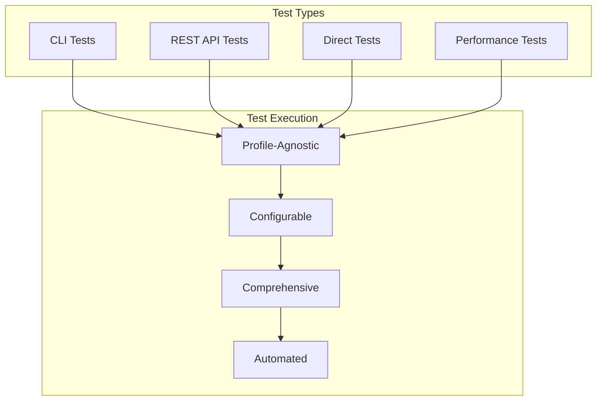

# Ultra Arena - Setup and Testing Guide

This comprehensive guide covers how to set up, configure, and test the Ultra Arena platform across all its components. The platform is designed to be profile-agnostic, allowing you to run tests and processes using any profile configuration.

## 📋 Table of Contents

1. [Prerequisites](#prerequisites)
2. [Installation](#installation)
3. [Profile Configuration](#profile-configuration)
4. [Running Tests](#running-tests)
5. [Server Setup](#server-setup)
6. [Monitoring Dashboard](#monitoring-dashboard)
7. [Troubleshooting](#troubleshooting)

## 🚀 Prerequisites

Before setting up Ultra Arena, ensure you have the following:

- **Python 3.8+** with pip
- **Git** for cloning the repository
- **API Keys** for LLM providers you plan to use
- **Test Data** (PDF files for processing)

### Required API Keys

The platform supports multiple LLM providers. Configure at least one:

- **Google Gemini**: `GCP_API_KEY`
- **OpenAI GPT**: `OPENAI_API_KEY`
- **Claude (Anthropic)**: `CLAUDE_API_KEY`
- **DeepSeek**: `DEEPSEEK_API_KEY`
- **TogetherAI**: `TOGETHERAI_API_KEY`
- **XAI (Grok)**: `XAI_API_KEY`
- **HuggingFace**: `HUGGINGFACE_TOKEN`

## 🔧 Installation

### 1. Clone the Repository

```bash
git clone git@github.com:horselord-joe-8053/ultra-arena-plus.git
cd ultra-arena-plus
```

### 2. Install Dependencies

Install dependencies for each component you plan to use:

```bash
# Core processing engine
cd Ultra_Arena_Main
pip install -r requirements.txt

# CLI interface
cd ../Ultra_Arena_Main_CLI
pip install -r requirements.txt

# REST API server
cd ../Ultra_Arena_Main_Restful
pip install -r requirements.txt

# Monitoring dashboard
cd ../Ultra_Arena_Monitor/backend
pip install -r requirements.txt
```

### 3. Verify Installation

```bash
# Test core functionality
cd Ultra_Arena_Main
python -c "import main_modular; print('✅ Core engine ready')"

# Test CLI
cd ../Ultra_Arena_Main_CLI
python main.py --help

# Test REST server
cd ../Ultra_Arena_Main_Restful
python -c "import server; print('✅ REST server ready')"
```

## ⚙️ Profile Configuration

Ultra Arena uses a flexible, profile-based configuration system. Profiles are located in `run_profiles/` directories within each component.

### Profile Structure

Each profile contains:

```
run_profiles/
└── [profile_name]/
    ├── profile_config.py          # Main configuration
    ├── profile_prompts_config.py  # Prompt templates
    └── config_api_keys.py         # API keys (REST only)
```

### Profile Types

| Component | Profile Directory | Purpose |
|-----------|-------------------|---------|
| **CLI** | `Ultra_Arena_Main_CLI/run_profiles/` | Command-line processing |
| **REST API** | `Ultra_Arena_Main_Restful/run_profiles/` | Web API processing |
| **Direct Test** | `Ultra_Arena_Main_Direct_Test/run_profiles/` | Direct testing |

### Creating Custom Profiles

1. **Copy an existing profile**:
   ```bash
   cp -r Ultra_Arena_Main_CLI/run_profiles/default_profile_cli \
        Ultra_Arena_Main_CLI/run_profiles/my_custom_profile
   ```

2. **Modify configuration files**:
   ```python
   # profile_config.py
   DEFAULT_STRATEGY = "direct_file"
   DEFAULT_PROVIDER = "google"
   DEFAULT_TIMEOUT = 600
   MAX_CONCURRENT_STRATEGIES = 4
   ```

3. **Update prompts**:
   ```python
   # profile_prompts_config.py
   SYSTEM_PROMPT = "Your custom system prompt..."
   USER_PROMPT = "Your custom user prompt..."
   MANDATORY_KEYS = ['FIELD1', 'FIELD2', 'FIELD3']
   ```

### Profile-Agnostic Testing

The platform is designed to work with any profile. You can:

- **Use default profiles** for immediate testing
- **Create custom profiles** for specific use cases
- **Switch profiles** at runtime using command-line arguments
- **Override profile settings** with environment variables

## 🧪 Running Tests

Ultra Arena provides comprehensive testing frameworks for all components. Tests are profile-agnostic and can be run with any configuration.

### Test Framework Overview



### 1. CLI Testing

CLI tests validate command-line interface functionality and processing workflows.

```bash
cd Ultra_Arena_Main_CLI_Test

# Run all CLI tests
python -m pytest tests/python_tests/ -v

# Run specific test categories
python -m pytest tests/python_tests/example_tests/ -v
python -m pytest tests/python_tests/performance_tests/ -v

# Run with custom profile
python -m pytest tests/python_tests/ -v --profile my_custom_profile
```

**Available CLI Tests**:

| Test File | Purpose | Coverage |
|-----------|---------|----------|
| `example_cli_minimal.py` | Basic CLI operations | File processing, error handling |
| `example_cli_combo.py` | Combo processing | Multi-strategy workflows |
| `comprehensive_performance_test.py` | Performance benchmarks | Throughput, latency, resource usage |

### 2. REST API Testing

REST API tests validate web interface functionality and API endpoints.

```bash
cd Ultra_Arena_Main_Restful_Test

# Start the server first (in another terminal)
cd ../Ultra_Arena_Main_Restful
python server.py

# Run API tests
cd ../Ultra_Arena_Main_Restful_Test
python -m pytest tests/python_tests/ -v

# Run specific test categories
python -m pytest tests/python_tests/health_tests/ -v
python -m pytest tests/python_tests/functional_tests/ -v
python -m pytest tests/python_tests/performance_tests/ -v
```

**Available REST API Tests**:

| Test File | Purpose | Endpoints Tested |
|-----------|---------|------------------|
| `simple_test_health.py` | Server health | `/health` |
| `simple_test_get_combos.py` | Combo listing | `/api/combos` |
| `simple_test_process_combo.py` | Combo processing | `/api/process/combo` |
| `simple_test_process_files.py` | File processing | `/api/process/files` |
| `comprehensive_performance_test.py` | Performance suite | All endpoints |

### 3. Direct Testing

Direct tests bypass API layers to test the core processing engine directly.

```bash
cd Ultra_Arena_Main_Direct_Test

# Run direct tests
python main.py

# Run with specific profile
python main.py --profile default_profile_direct_test

# Run performance tests
python main.py --performance-test
```

**Direct Test Features**:
- **Fast execution** (no API overhead)
- **Direct core access** (bypasses interface layers)
- **Profile-agnostic** (works with any profile)
- **Comprehensive coverage** (all processing strategies)

### 4. Performance Testing

Performance tests measure system throughput, latency, and resource usage.

```bash
# CLI Performance Tests
cd Ultra_Arena_Main_CLI_Test/tests/python_tests/performance_tests/
python comprehensive_performance_test.py

# REST API Performance Tests
cd Ultra_Arena_Main_Restful_Test/tests/python_tests/performance_tests/
python comprehensive_performance_test.py
```

**Performance Metrics**:

| Metric | Target | Measurement |
|--------|--------|-------------|
| **Processing Time** | < 60s per file | Wall clock time |
| **Throughput** | > 1 file/min | Files processed per minute |
| **Success Rate** | > 95% | Successful processing percentage |
| **Memory Usage** | < 500MB | Peak memory consumption |
| **Response Time** | < 2s | API response time |

### 5. Test Configuration

Tests can be configured using:

**Command-line arguments**:
```bash
python -m pytest tests/ -v --profile my_profile --timeout 300
```

**Environment variables**:
```bash
export ULTRA_ARENA_PROFILE=my_profile
export ULTRA_ARENA_TIMEOUT=300
python -m pytest tests/ -v
```

**Test configuration files**:
```python
# test_config.py
DEFAULT_PROFILE = "default_profile_cli"
DEFAULT_TIMEOUT = 300
TEST_FILES_DIR = "test_fixtures/default_fixture/"
```

## 🖥️ Server Setup

### 1. REST API Server

The REST API server provides web-based access to the Ultra Arena platform.

```bash
cd Ultra_Arena_Main_Restful

# Configure API keys (required)
cp run_profiles/default_profile_restful/config_api_keys.py.example \
   run_profiles/default_profile_restful/config_api_keys.py
# Edit config_api_keys.py with your actual API keys

# Start the server
python server.py
```

**Server Configuration**:

| Setting | Default | Description |
|---------|---------|-------------|
| **Host** | `0.0.0.0` | Server bind address |
| **Port** | `5002` | Server port |
| **Debug** | `False` | Debug mode |
| **Threading** | `True` | Multi-threading support |

**Environment Variables**:
```bash
export RUN_PROFILE=default_profile_restful
export PORT=5002
export HOST=0.0.0.0
python server.py
```

### 2. Monitoring Dashboard

The monitoring dashboard provides real-time performance visualization.

```bash
cd Ultra_Arena_Monitor

# Start backend server
cd backend
python server.py

# Start frontend (in new terminal)
cd ../frontend
python -m http.server 3000
```

**Access URLs**:
- **Frontend Dashboard**: http://localhost:3000
- **Backend API**: http://localhost:5000

### 3. Server Management Scripts

Use provided scripts for server management:

```bash
# Start server
cd Ultra_Arena_Main_Restful_Test/rest_server_start_scripts/
./start_server.sh

# Stop server
./stop_server.sh

# Debug server loading
python debug_combo_loading.py
```

## 📊 Monitoring Dashboard

The monitoring dashboard provides real-time insights into system performance and processing metrics.

### Dashboard Features

- **Real-time Metrics**: Live performance data
- **Interactive Charts**: Visual performance comparisons
- **Strategy Comparison**: Side-by-side strategy analysis
- **Cost Analysis**: Token usage and cost tracking
- **Error Monitoring**: Failed request tracking

### Configuration

```python
# Ultra_Arena_Monitor/config/monitoring_config.py
REAL_TIME_MONITORING = True
UPDATE_FREQUENCY_SECONDS = 1
FILE_WATCH_ENABLED = True
JSON_DATA_DIR = "../Ultra_Arena_Main_Restful_Test/test_fixtures/default_fixture/output_files/results/results_*/json"
```

### Chart Configuration

```python
# Ultra_Arena_Monitor/config/chart_config.py
chart_config_all = {
    "chart_config_1": {
        "comparing_fields": {
            "overall_stats": {
                "total_files": {"chart_title": "Total Files Processed"},
                "total_wall_time_in_sec": {"chart_title": "Total Processing Time In Seconds"},
                "total_actual_tokens": {"chart_title": "All Tokens Spent"}
            },
            "overall_cost": {
                "total_token_cost": {"chart_title": "Total Cost for All Tokens ($USD)"}
            },
            "benchmark_comparison": {
                "invalid_fields_percent": {"chart_title": "Percentage of Incorrectly Extracted Fields"},
                "invalid_files_percent": {"chart_title": "Percentage of Incorrectly Processed Files"}
            }
        }
    }
}
```

## 🔍 Troubleshooting

### Common Issues

**1. API Key Configuration**
```bash
# Error: API key not found
# Solution: Configure API keys in profile
cp run_profiles/default_profile_restful/config_api_keys.py.example \
   run_profiles/default_profile_restful/config_api_keys.py
# Edit with your actual API keys
```

**2. Profile Not Found**
```bash
# Error: Profile 'my_profile' not found
# Solution: Create profile or use existing one
ls run_profiles/
# Use: --profile default_profile_cli
```

**3. Test Files Not Found**
```bash
# Error: Test fixtures not found
# Solution: Verify test fixture structure
ls test_fixtures/default_fixture/
# Ensure input_files/ and output_files/ exist
```

**4. Server Port Already in Use**
```bash
# Error: Port 5002 already in use
# Solution: Use different port
export PORT=5003
python server.py
```

**5. Memory Issues**
```bash
# Error: Out of memory
# Solution: Reduce concurrency
export MAX_CONCURRENT_STRATEGIES=2
export MAX_CONCURRENT_FILEGROUPS=3
```

### Debug Mode

Enable debug mode for detailed logging:

```bash
# CLI Debug
python main.py --verbose --debug

# REST API Debug
export DEBUG=true
python server.py

# Test Debug
python -m pytest tests/ -v -s --log-cli-level=DEBUG
```

### Log Analysis

Check logs for troubleshooting:

```bash
# Core processing logs
tail -f Ultra_Arena_Main/output/logs/processing.log

# REST API logs
tail -f Ultra_Arena_Main_Restful/logs/server.log

# Test logs
tail -f Ultra_Arena_Main_CLI_Test/logs/test.log
```

### Performance Optimization

**For High Throughput**:
```bash
# Increase concurrency
export MAX_CONCURRENT_STRATEGIES=8
export MAX_CONCURRENT_FILEGROUPS=10

# Use parallel processing
python main.py --mode parallel --max-workers 8
```

**For Memory Efficiency**:
```bash
# Reduce concurrency
export MAX_CONCURRENT_STRATEGIES=2
export MAX_CONCURRENT_FILEGROUPS=3

# Use batch processing
python main.py --mode batch
```

## 📚 Additional Resources

### Documentation
- **Component READMEs**: Each component has detailed documentation
- **API Documentation**: REST API endpoints and usage
- **Configuration Guide**: Profile and configuration options

### Examples
- **Test Fixtures**: Sample data for testing
- **Profile Examples**: Various configuration examples
- **Performance Benchmarks**: Expected performance metrics

### Support
- **GitHub Issues**: Report bugs and request features
- **Documentation**: Comprehensive guides and references
- **Community**: Developer discussions and support

---

This guide provides comprehensive coverage of Ultra Arena setup and testing. The platform's profile-agnostic design ensures flexibility and ease of use across different deployment scenarios and use cases.
