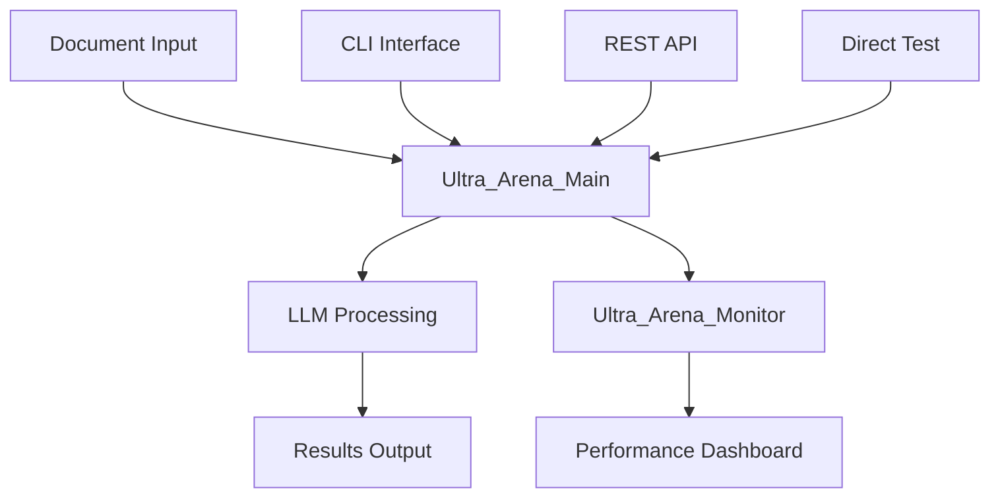

# Ultra Arena - Multi-LLM Processing and Evaluation Platform

## **Ultra Arena** - A comprehensive platform for LLM evaluation and intelligent task execution.

• 🔍 **Evaluates** Large Language Model (LLM) providers, models, and processing mechanisms  
• ⚖️ **Compares** LLM solutions by executing identical tasks across multiple providers  
• 📈 **Measures** performance, cost, and quality metrics systematically  
• 🤖 **Functions as an intelligent agent** - can be configured to automatically execute tasks using the best-performing strategy based on evaluation results

## Key Features

- **Multi-Provider Support**: Evaluate well-known LLM providers including cloud-based and locally hosted models
- **Flexible Task Processing**: Handle text-only inputs or complex multi-modal tasks with file attachments
- **Strategy Comparison**: Test unique combinations of LLM providers, models, and processing mechanisms (e.g., OCR text extraction, PDF-to-image conversion, or direct processing)
- **Performance Analytics**: Comprehensive evaluation of response times, accuracy, cost per request, and throughput
- **Modular Architecture**: Scalable design supporting CLI, REST API, and direct testing interfaces
- **Dual-Level Parallelization**: 
  - **Strategy-Level**: Process multiple LLM strategies concurrently for efficient comparison
  - **File-Level**: Handle multiple input files in parallel within each strategy for optimal throughput
  - **Configurable Concurrency**: Adjustable parallelization levels to optimize for your hardware and workload requirements

## 🏗️ Workspace Structure

```
ultra-arena-plus/
├── Ultra_Arena_Main/                 # Core processing engine
├── Ultra_Arena_Main_CLI/             # Command-line interface
├── Ultra_Arena_Main_CLI_Test/        # CLI testing framework
├── Ultra_Arena_Main_Restful/         # REST API server
├── Ultra_Arena_Main_Restful_Test/    # REST API testing suite
├── Ultra_Arena_Main_Direct_Test/     # Direct testing framework
├── Ultra_Arena_Monitor/              # Real-time monitoring dashboard
├── cursor_gen/                       # AI-generated documentation
├── clean_cache.sh                    # Cache cleaning utility
└── pytest.ini                       # Test configuration
```

## 📋 Project Overview

| Project | Purpose | Technology | Status |
|---------|---------|------------|--------|
| **Ultra_Arena_Main** | <small>Core LLM processing engine with modular architecture</small> | <small>Python</small> | <small>✅ Active</small> |
| **Ultra_Arena_Main_CLI** | <small>Command-line interface for document processing</small> | <small>Python CLI</small> | <small>✅ Active</small> |
| **Ultra_Arena_Main_Restful** | <small>REST API server for web integration</small> | <small>Flask/Python</small> | <small>✅ Active</small> |
| **Ultra_Arena_Monitor** | <small>Performance monitoring dashboard</small> | <small>Static HTML/JS</small> | <small>✅ Active</small> |
| **Ultra_Arena_Main_CLI_Test** | <small>Comprehensive CLI testing framework</small> | <small>Python/Pytest</small> | <small>✅ Active</small> |
| **Ultra_Arena_Main_Restful_Test** | <small>REST API testing suite</small> | <small>Python/Requests</small> | <small>✅ Active</small> |
| **Ultra_Arena_Main_Direct_Test** | <small>Direct testing without API layer</small> | <small>Python</small> | <small>✅ Active</small> |

## 🚀 Quick Start

### Prerequisites
- Python 3.8+
- Git

### Setup
```bash
# Clone the repository
git clone <repository-url>
cd ultra-arena-plus

# Install dependencies for each component
cd Ultra_Arena_Main && pip install -r requirements.txt
cd ../Ultra_Arena_Main_CLI && pip install -r requirements.txt
cd ../Ultra_Arena_Main_Restful && pip install -r requirements.txt
```

### Running Components

#### CLI Processing
```bash
cd Ultra_Arena_Main_CLI
python main.py --help
```

#### REST API Server
```bash
cd Ultra_Arena_Main_Restful
python server.py
```

#### Monitoring Dashboard
```bash
cd Ultra_Arena_Monitor/frontend
python -m http.server 3000
```

## 🧪 Testing

### Run All Tests
```bash
# Clean cache first
./clean_cache.sh

# Run tests
pytest Ultra_Arena_Main_CLI_Test/
pytest Ultra_Arena_Main_Restful_Test/
pytest Ultra_Arena_Main_Direct_Test/
```

### Performance Testing
```bash
# CLI Performance
cd Ultra_Arena_Main_CLI_Test/tests/python_tests/performance_tests/
python comprehensive_performance_test.py

# REST API Performance
cd Ultra_Arena_Main_Restful_Test/tests/python_tests/performance_tests/
python comprehensive_performance_test.py
```

## 📊 Architecture Overview



## 🔧 Configuration

Each project has its own configuration:
- **Ultra_Arena_Main**: `config/config_base.py`
- **Ultra_Arena_Main_CLI**: `run_profiles/default_profile_cli/`
- **Ultra_Arena_Main_Restful**: `run_profiles/default_profile_restful/`

## 📈 Performance Monitoring

The monitoring dashboard provides insights into:
- Processing throughput
- Response times
- Error rates
- Resource utilization

### Performance Highlights

The goal is a practical balance of accuracy (lower error rates), speed (lower total processing time), and cost (lower total token cost). Across multiple evaluation runs, Google Gemini consistently demonstrates superior performance on this composite metric.


*Performance comparison across 8 LLM configurations showing accuracy, speed, and cost metrics. Lower bars indicate better performance for most charts.*


*Performance comparison across 4 LLM configurations with refined evaluation setup. Lower bars indicate better performance for most charts.*

**Key Performance Takeaways:**

- **Accuracy Excellence**: Google Gemini (`direct_file` and `text_first` strategies) consistently achieve the lowest percentages for incorrectly extracted fields and incorrectly processed files
- **Speed Leadership**: Gemini strategies demonstrate significantly lower total processing times compared to other providers
- **Cost Efficiency**: Gemini achieves the lowest total token cost while maintaining high accuracy, making it the most cost-effective choice
- **Overall Winner**: Considering the balance of accuracy, speed, and cost jointly, Google Gemini emerges as the optimal choice for practical LLM applications

*Note: Results are based on specific evaluation runs and may vary depending on dataset characteristics and processing requirements. The monitoring dashboard computes these metrics directly from result JSONs generated by the evaluation framework.*

## 🆕 Recent Updates

### Latest Improvements
- **Clean Repository**: Removed API keys and sensitive data from git history
- **Accurate Documentation**: All README files now match actual code implementation
- **Directory Restructure**: Renamed `server/` to `server_utils/` for better organization
- **BSD 3-Clause License**: Added proper open-source licensing
- **Professional Documentation**: Enhanced README with accurate technical details

### Security & Cleanup
- ✅ API keys removed from repository
- ✅ Generated files properly ignored
- ✅ Clean git history maintained
- ✅ Professional author attribution

## 🤝 Contributing

1. Follow the modular architecture pattern
2. Add comprehensive tests for new features
3. Update documentation for any API changes
4. Run performance tests before submitting

## 📝 License

This project is licensed under the **BSD 3-Clause License** - see the [LICENSE](LICENSE) file for details.

**Copyright (c) 2025 Coder.Joe.8053**

The BSD 3-Clause License is a permissive license that allows for:
- Commercial use
- Modification and distribution
- Private use
- Patent use

The license requires that the copyright notice and license text be included in all copies or substantial portions of the software.

## 📊 Repository Status

### Current State
- **Repository**: `git@github.com:horselord-joe-8053/ultra-arena-plus.git`
- **Author**: `coder.joe.8053 <coder.joe.8053@gmail.com>`
- **License**: BSD 3-Clause License
- **Status**: Active development with clean, professional codebase

### Key Features Implemented
- ✅ Multi-LLM provider support (Claude, GPT, DeepSeek, etc.)
- ✅ Multiple processing strategies (direct file, image first, text only, hybrid)
- ✅ Dual-level parallelization (strategy and file level)
- ✅ Comprehensive testing frameworks
- ✅ Performance monitoring and analytics
- ✅ CLI, REST API, and direct testing interfaces

---

For detailed documentation on each component, see the individual README.md files in each project directory.
