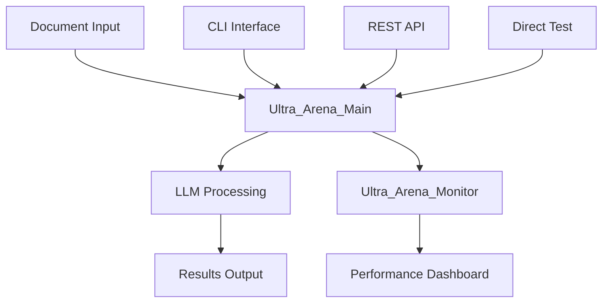

# Ultra Arena - Multi-Component LLM Processing Platform

A comprehensive platform for processing documents through various LLM providers with multiple deployment and testing strategies.

## 🏗️ Workspace Structure

```
ultra-arena-plus/
├── Ultra_Arena_Main/                 # Core processing engine
├── Ultra_Arena_Main_CLI/             # Command-line interface
├── Ultra_Arena_Main_CLI_Test/        # CLI testing framework
├── Ultra_Arena_Main_Restful/         # REST API server
├── Ultra_Arena_Main_Restful_Test/    # REST API testing suite
├── Ultra_Arena_Main_Direct_Test/     # Direct testing framework
├── Ultra_Arena_Monitor/              # Real-time monitoring dashboard
├── cursor_gen/                       # AI-generated documentation
├── clean_cache.sh                    # Cache cleaning utility
└── pytest.ini                       # Test configuration
```

## 📋 Project Overview

| Project | Purpose | Technology | Status |
|---------|---------|------------|--------|
| **Ultra_Arena_Main** | Core LLM processing engine with modular architecture | Python | ✅ Active |
| **Ultra_Arena_Main_CLI** | Command-line interface for document processing | Python CLI | ✅ Active |
| **Ultra_Arena_Main_Restful** | REST API server for web integration | FastAPI/Python | ✅ Active |
| **Ultra_Arena_Monitor** | Real-time performance monitoring dashboard | Node.js/React | ✅ Active |
| **Ultra_Arena_Main_CLI_Test** | Comprehensive CLI testing framework | Python/Pytest | ✅ Active |
| **Ultra_Arena_Main_Restful_Test** | REST API testing suite | Python/Requests | ✅ Active |
| **Ultra_Arena_Main_Direct_Test** | Direct testing without API layer | Python | ✅ Active |

## 🚀 Quick Start

### Prerequisites
- Python 3.8+
- Node.js 16+ (for monitoring dashboard)
- Git

### Setup
```bash
# Clone the repository
git clone <repository-url>
cd ultra-arena-plus

# Install dependencies for each component
cd Ultra_Arena_Main && pip install -r requirements.txt
cd ../Ultra_Arena_Main_CLI && pip install -r requirements.txt
cd ../Ultra_Arena_Main_Restful && pip install -r requirements.txt
cd ../Ultra_Arena_Monitor && npm install
```

### Running Components

#### CLI Processing
```bash
cd Ultra_Arena_Main_CLI
python main.py --help
```

#### REST API Server
```bash
cd Ultra_Arena_Main_Restful
python server.py
```

#### Monitoring Dashboard
```bash
cd Ultra_Arena_Monitor
npm start
```

## 🧪 Testing

### Run All Tests
```bash
# Clean cache first
./clean_cache.sh

# Run tests
pytest Ultra_Arena_Main_CLI_Test/
pytest Ultra_Arena_Main_Restful_Test/
pytest Ultra_Arena_Main_Direct_Test/
```

### Performance Testing
```bash
# CLI Performance
cd Ultra_Arena_Main_CLI_Test/tests/python_tests/performance_tests/
python comprehensive_performance_test.py

# REST API Performance
cd Ultra_Arena_Main_Restful_Test/tests/python_tests/performance_tests/
python comprehensive_performance_test.py
```

## 📊 Architecture Overview



## 🔧 Configuration

Each project has its own configuration:
- **Ultra_Arena_Main**: `config/config_base.py`
- **Ultra_Arena_Main_CLI**: `run_profiles/default_profile_cli/`
- **Ultra_Arena_Main_Restful**: `run_profiles/default_profile_restful/`

## 📈 Performance Monitoring

The monitoring dashboard provides real-time insights into:
- Processing throughput
- Response times
- Error rates
- Resource utilization

## 🤝 Contributing

1. Follow the modular architecture pattern
2. Add comprehensive tests for new features
3. Update documentation for any API changes
4. Run performance tests before submitting

## 📝 License

[Add your license information here]

---

For detailed documentation on each component, see the individual README.md files in each project directory.
