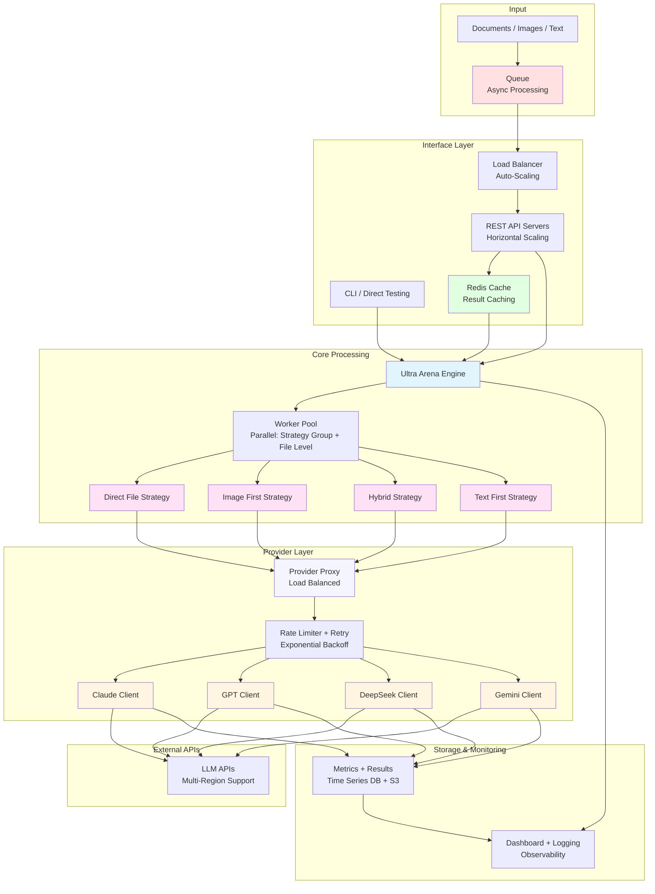
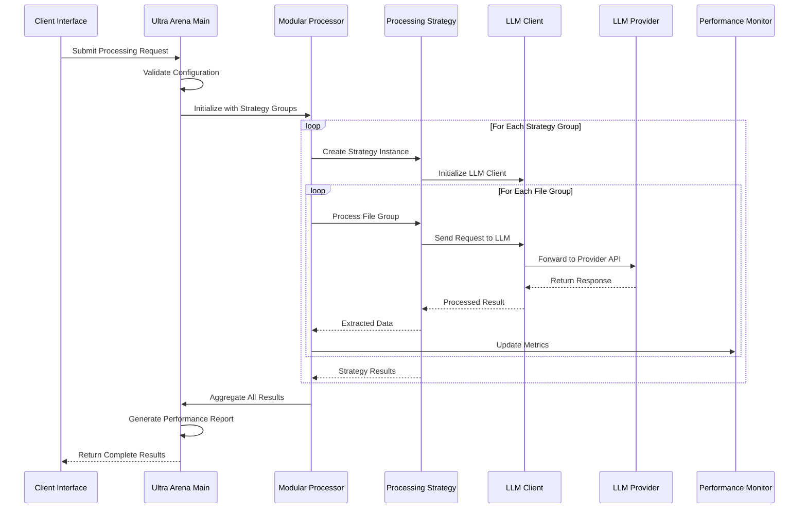
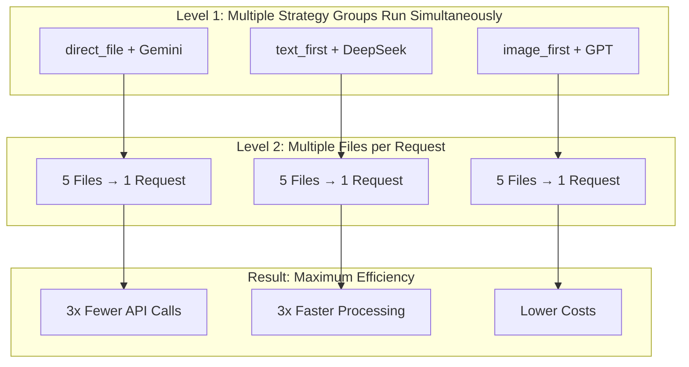
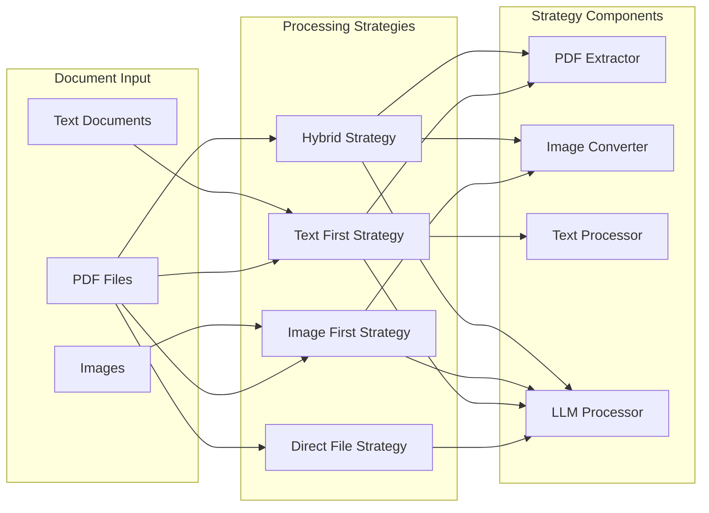

# Ultra Arena Plus

### Multi-LLM Processing and Evaluation Platform

A comprehensive platform for **LLM evaluation**, **intelligent document processing**, and **data-driven model selection** — built with a modular, production-oriented architecture.

| | |
|---|---|
| 🔍 **Evaluate** | Compare LLM providers, models, and processing mechanisms side by side |
| ⚖️ **Compare** | Run identical tasks across multiple providers with consistent metrics |
| 📈 **Measure** | Track performance, cost, accuracy, and throughput systematically |
| 🤖 **Automate** | Configure the system to execute tasks using the best-performing strategy |

---

## Platform Overview

<a href="https://drive.google.com/file/d/15FWKfDkFE5Vox9PZIRsvzxqBcnG87wC0/view?usp=drive_link" target="_blank">
  
</a><br/>
<sub>Platform overview video (generated by NotebookLM)</sub>

---

## Core Architecture

**Key pattern:** Modular, extensible LLM evaluation system with clear separation between *how* documents are processed (strategies) and *who* processes them (LLM providers).

### 1. Multi-Provider Abstraction

LLM providers sit behind a common interface — swap vendors without rewriting business logic.

```
Base Class: LLMClientBase
  ├── ClaudeClient
  ├── GPTClient
  ├── DeepSeekClient
  ├── GeminiClient
  ├── OllamaClient (local)
  └── Custom Providers
```

| Benefit | Why it matters |
|---------|----------------|
| Vendor lock-in avoidance | Freedom to migrate or mix providers |
| Easy A/B testing | Compare models on the same workload |
| Cost optimization | Use the cheapest model that meets quality bar |
| Fallback mechanisms | Graceful degradation when a provider fails |
| Consistent interface | One API surface across all providers |

### 2. Strategy Pattern for Processing

Processing strategies are **decoupled** from LLM clients — enabling combinatorial testing and independent evolution.

```
Strategies (HOW to process)          LLM Clients (WHO processes)
  ├── Direct File Strategy             ├── Claude
  ├── Image First Strategy             ├── GPT
  ├── Text First Strategy              ├── Gemini
  ├── Hybrid Strategy                  └── Others
  └── Chain Strategy (fallback pipeline)
```

- Change a strategy without touching client code
- Test every strategy × every provider combination
- Reuse the same strategy across any provider
- Mock clients easily in tests

### 3. Dual-Level Parallelization

Two parallelization layers work together for maximum throughput:

| Level | What runs in parallel | Benefit |
|-------|----------------------|---------|
| **Strategy-group-level** | Multiple configured runs (processing strategy + provider + model) at once | Faster evaluation cycles, side-by-side comparison |
| **File-level** | Multiple files batched into single requests within each run | Fewer API calls, lower cost, higher throughput |

Each **strategy group** is a full configuration — for example, `direct_file + Gemini`, `text_first + DeepSeek`, or `image_first + GPT`. Processing **strategies** (direct file, text first, image first, hybrid) describe *how* documents are handled; the LLM **provider** is a separate choice paired at configuration time.

Configurable concurrency (`max_cc_strategies`, `max_cc_filegroups`) adapts to hardware limits, rate limits, and budget.

### 4. Modular Multi-Interface Design

One core engine, multiple entry points:

| Interface | Purpose |
|-----------|---------|
| **CLI** | Batch processing, automation, CI/CD |
| **REST API** | Service integration, web and mobile backends |
| **Direct Testing** | Unit tests, performance benchmarks, debugging without API overhead |
| **Monitoring Dashboard** | Real-time metrics and comparison views |

All interfaces share **Ultra_Arena_Main** as the single source of truth.

### 5. Performance Monitoring & Metrics

Every run produces actionable data:

- Response time per provider / strategy
- Token usage and cost tracking
- Success / failure rates
- Throughput (requests per second)
- Cost per request and per file

---

## End-to-End System Diagram

> **Powerful Usage Example: Ultra Arena Plus System Processing Documents**
>
> The diagram below shows a production-scale document processing flow — from async input ingestion through parallel strategy execution, multi-provider LLM calls, and centralized observability. Components such as a message queue, Redis, and horizontal API scaling represent the target architecture for high-volume deployments; the core engine and strategy/provider layers are implemented today.


```mermaid
graph TB
    subgraph INPUT_LAYER["Input"]
        INPUT["Documents / Images / Text"]
        QUEUE["Queue<br/>Async Processing"]
    end
    
    subgraph INTERFACE_LAYER["Interface Layer"]
        LB["Load Balancer<br/>Auto-Scaling"]
        API["REST API Servers<br/>Horizontal Scaling"]
        CLI["CLI / Direct Testing"]
        CACHE["Redis Cache<br/>Result Caching"]
    end
    
    subgraph CORE_LAYER["Core Processing"]
        CORE["Ultra Arena Engine"]
        WORKERS["Worker Pool<br/>Parallel: Strategy Group + File Level"]
        S1["Direct File Strategy"]
        S2["Image First Strategy"]
        S3["Hybrid Strategy"]
        S4["Text First Strategy"]
    end
    
    subgraph PROVIDER_LAYER["Provider Layer"]
        PROXY["Provider Proxy<br/>Load Balanced"]
        P1["Claude Client"]
        P2["GPT Client"]
        P3["DeepSeek Client"]
        P4["Gemini Client"]
        RETRY["Rate Limiter + Retry<br/>Exponential Backoff"]
    end
    
    subgraph EXTERNAL_LAYER["External APIs"]
        LLM_APIS["LLM APIs<br/>Multi-Region Support"]
    end
    
    subgraph STORAGE_LAYER["Storage & Monitoring"]
        STORAGE["Metrics + Results<br/>Time Series DB + S3"]
        MONITOR["Dashboard + Logging<br/>Observability"]
    end
    
    INPUT --> QUEUE
    QUEUE --> LB
    CLI --> CORE
    LB --> API
    API --> CACHE
    API --> CORE
    CACHE --> CORE
    CORE --> WORKERS
    WORKERS --> S1
    WORKERS --> S2
    WORKERS --> S3
    WORKERS --> S4
    S1 --> PROXY
    S2 --> PROXY
    S3 --> PROXY
    S4 --> PROXY
    PROXY --> RETRY
    RETRY --> P1
    RETRY --> P2
    RETRY --> P3
    RETRY --> P4
    P1 --> LLM_APIS
    P2 --> LLM_APIS
    P3 --> LLM_APIS
    P4 --> LLM_APIS
    P1 --> STORAGE
    P2 --> STORAGE
    P3 --> STORAGE
    P4 --> STORAGE
    STORAGE --> MONITOR
    CORE --> MONITOR
    
    style CORE fill:#e1f5ff
    style S1 fill:#ffe1f5
    style S2 fill:#ffe1f5
    style S3 fill:#ffe1f5
    style S4 fill:#ffe1f5
    style P1 fill:#fff5e1
    style P2 fill:#fff5e1
    style P3 fill:#fff5e1
    style P4 fill:#fff5e1
    style CACHE fill:#e1ffe1
    style QUEUE fill:#ffe1e1
    style PROXY fill:#f5f5ff
```

### Scalability Characteristics

| Layer | Design |
|-------|--------|
| **API** | Horizontal scaling behind a load balancer; stateless servers |
| **Processing** | Parallel at strategy-group and file levels with configurable worker pools |
| **Async input** | Queue-based ingestion decouples spikes from processing |
| **Caching** | Result cache reduces redundant LLM calls |
| **Providers** | Load-balanced proxy with rate limiting and exponential backoff retries |
| **Storage** | Time-series metrics + object storage for long-term results |
| **Observability** | Centralized logging, tracing, and dashboard alerting |

---

## Processing Flow


```mermaid
sequenceDiagram
    participant Client as Client Interface
    participant Main as Ultra Arena Main
    participant Processor as Modular Processor
    participant Strategy as Processing Strategy
    participant LLM as LLM Client
    participant Provider as LLM Provider
    participant Monitor as Performance Monitor
    
    Client->>Main: Submit Processing Request
    Main->>Main: Validate Configuration
    Main->>Processor: Initialize with Strategy Groups
    
    loop For Each Strategy Group
        Processor->>Strategy: Create Strategy Instance
        Strategy->>LLM: Initialize LLM Client
        
        loop For Each File Group
            Processor->>Strategy: Process File Group
            Strategy->>LLM: Send Request to LLM
            LLM->>Provider: Forward to Provider API
            Provider-->>LLM: Return Response
            LLM-->>Strategy: Processed Result
            Strategy-->>Processor: Extracted Data
            
            Processor->>Monitor: Update Metrics
        end
        
        Strategy-->>Processor: Strategy Results
    end
    
    Processor->>Main: Aggregate All Results
    Main->>Main: Generate Performance Report
    Main-->>Client: Return Complete Results
```

1. **Request initialization** — Validate configuration and spin up the modular processor with strategy groups.
2. **Strategy-group execution** — For each group, create the processing strategy instance and LLM client (strategy + provider + model); run groups concurrently.
3. **File processing** — Batch files into groups for optimal throughput at both parallelism levels.
4. **Result aggregation** — Collect outputs and generate comparison metrics across all strategy groups.

---

## Key Features

- **Multi-Provider Support** — Cloud and locally hosted models (Claude, GPT, Gemini, DeepSeek, Ollama, and more)
- **Flexible Task Processing** — Text-only inputs or multi-modal tasks with file attachments
- **Strategy Comparison** — Unique combinations of provider, model, and mechanism (OCR, PDF-to-image, direct file)
- **Performance Analytics** — Response times, accuracy, cost per request, and throughput
- **Modular Architecture** — CLI, REST API, direct testing, and monitoring dashboard

### Advanced Multi-Level Parallelization

Ultra Arena Plus combines **strategy-group-level** and **file-level** parallelism. A **processing strategy** defines *how* documents are handled (`direct_file`, `text_first`, `image_first`, `hybrid`). A **strategy group** is a configured evaluation run that pairs one processing strategy with a specific LLM provider and model — that is what runs in parallel at level 1.


```mermaid
graph TB
    subgraph "Level 1: Multiple Strategy Groups Run Simultaneously"
        A["direct_file + Gemini"]
        B["text_first + DeepSeek"]
        C["image_first + GPT"]
    end
    
    subgraph "Level 2: Multiple Files per Request"
        D[5 Files → 1 Request]
        E[5 Files → 1 Request]
        F[5 Files → 1 Request]
    end
    
    subgraph "Result: Maximum Efficiency"
        G[3x Fewer API Calls]
        H[3x Faster Processing]
        I[Lower Costs]
    end
    
    A --> D
    B --> E
    C --> F
    
    D --> G
    E --> H
    F --> I
```

**How it works:**
- **Strategy-group-level**: Run multiple configured combinations (e.g., `direct_file + Gemini`, `text_first + DeepSeek`) at the same time — not one strategy per provider by default
- **File-level**: Group multiple files into a single LLM request instead of one file per call
- **Combined effect**: Process 15 files across 3 groups with 3 batched API calls instead of 15

| Metric | Traditional | Ultra Arena Plus | Improvement |
|--------|-------------|------------------|-------------|
| **API Calls** | 100 files = 100 calls | 100 files = 20 calls | **80% reduction** |
| **Processing Time** | Sequential | Parallel | **4–8× faster** |
| **Token Efficiency** | Suboptimal | Optimized batching | **25–40% better** |
| **Cost per File** | Higher overhead | Lower overhead | **30–50% savings** |
| **Throughput** | Latency-bound | Bandwidth-bound | **5–10× increase** |

**Example — 100 PDFs × 4 strategy groups:**

| Approach | API calls | Execution |
|----------|-----------|-----------|
| Sequential (1 file per call, 4 groups) | 400 | ~400 min |
| Ultra Arena Plus (5 files per batch, groups in parallel) | 80 | ~20 min |

**Result:** ~5× faster with 80% fewer API calls.

---

## Processing Strategies


```mermaid
graph LR
    subgraph "Document Input"
        A[PDF Files]
        B[Text Documents]
        C[Images]
    end
    
    subgraph "Processing Strategies"
        D[Direct File Strategy]
        E[Text First Strategy]
        F[Image First Strategy]
        G[Hybrid Strategy]
    end
    
    subgraph "Strategy Components"
        H[PDF Extractor]
        I[Image Converter]
        J[Text Processor]
        K[LLM Processor]
    end
    
    A --> D
    A --> E
    A --> F
    A --> G
    
    B --> E
    C --> F
    
    D --> K
    E --> H
    E --> J
    E --> K
    F --> I
    F --> K
    G --> H
    G --> I
    G --> K
```

| Strategy | Description | Best for |
|----------|-------------|----------|
| **Direct File** | Sends entire PDFs to multi-modal LLM providers | Providers with native PDF support |
| **Text First** | Extracts text locally, then processes via LLM | Any text-capable provider |
| **Image First** | Converts PDF pages to images for vision models | Layout-sensitive documents |
| **Hybrid** | Combines approaches with automatic fallback | Maximum reliability |

---

## Workspace Structure

```
ultra-arena-plus/
├── Ultra_Arena_Main/                 # Core processing engine
├── Ultra_Arena_Main_CLI/             # Command-line interface
├── Ultra_Arena_Main_CLI_Test/        # CLI testing framework
├── Ultra_Arena_Main_Restful/         # REST API server
├── Ultra_Arena_Main_Restful_Test/    # REST API testing suite
├── Ultra_Arena_Main_Direct_Test/     # Direct testing framework
├── Ultra_Arena_Monitor/              # Real-time monitoring dashboard
├── cursor_gen/                       # AI-generated documentation
├── clean_cache.sh                    # Cache cleaning utility
└── pytest.ini                        # Test configuration
```

### Project Overview

| Project | Purpose | Technology | Status |
|---------|---------|------------|--------|
| **Ultra_Arena_Main** | Core LLM processing engine | Python | ✅ Active |
| **Ultra_Arena_Main_CLI** | Command-line document processing | Python CLI | ✅ Active |
| **Ultra_Arena_Main_Restful** | REST API for web integration | Flask / Python | ✅ Active |
| **Ultra_Arena_Monitor** | Performance monitoring dashboard | Static HTML / JS | ✅ Active |
| **Ultra_Arena_Main_CLI_Test** | CLI testing framework | Python / Pytest | ✅ Active |
| **Ultra_Arena_Main_Restful_Test** | REST API testing suite | Python / Requests | ✅ Active |
| **Ultra_Arena_Main_Direct_Test** | Direct testing without API layer | Python | ✅ Active |

---

## Configuration

Profile-based configuration supports multiple environments without code changes:

| Component | Config location |
|-----------|-----------------|
| **Core engine** | `Ultra_Arena_Main/config/config_base.py` |
| **CLI** | `Ultra_Arena_Main_CLI/run_profiles/default_profile_cli/` |
| **REST API** | `Ultra_Arena_Main_Restful/run_profiles/default_profile_restful/` |

**Hierarchy:** Base defaults → profile overrides → runtime settings → environment variables (API keys, deployment params).

---

## Performance Monitoring

The monitoring dashboard surfaces throughput, response times, error rates, and resource utilization — computed directly from evaluation result JSONs.

**Goal:** Balance accuracy (lower error rates), speed (lower total processing time), and cost (lower token spend).


*Performance comparison across 8 LLM configurations. Lower bars indicate better performance for most charts.*


*Refined evaluation across 4 configurations.*

**Key takeaways:**

- **Accuracy** — Google Gemini (`direct_file` and `text_first`) consistently achieves the lowest field- and file-level error rates
- **Speed** — Gemini strategies show significantly lower total processing times
- **Cost** — Gemini delivers the lowest total token cost while maintaining high accuracy
- **Overall** — Gemini offers the best joint balance of accuracy, speed, and cost for practical document processing

### Gemini at Scale

Approximately **30,000 files** processed on Google Gemini demonstrate cost-effectiveness at production volume:


---

## Contributing

1. Follow the modular architecture pattern (strategies ↔ clients separation)
2. Add comprehensive tests for new features
3. Update documentation for any API changes
4. Run performance tests before submitting

---

## License

**BSD 3-Clause License** — see [LICENSE](LICENSE).

Copyright (c) 2025 Coder.Joe.8053

---

## Repository

| | |
|---|---|
| **Remote** | `git@github.com:horselord-joe-8053/ultra-arena-plus.git` |
| **Author** | `coder.joe.8053 <coder.joe.8053@gmail.com>` |
| **License** | BSD 3-Clause |
| **Status** | Active development |

### Implemented Capabilities

- ✅ Multi-LLM provider support (Claude, GPT, Gemini, DeepSeek, and more)
- ✅ Multiple processing strategies (direct file, image first, text first, hybrid)
- ✅ Dual-level parallelization (strategy-group and file level)
- ✅ Comprehensive testing frameworks (CLI, REST, direct)
- ✅ Performance monitoring and analytics
- ✅ CLI, REST API, and direct testing interfaces

---

For component-level details, see the individual `README.md` files in each project directory.
