# Ultra Arena - Multi-Component LLM Processing and Evaluation Platform

A comprehensive platform that serves as a competitive arena for evaluating Large Language Model (LLM) providers, models, and processing mechanisms. Ultra Arena enables systematic comparison of different LLM solutions by executing identical tasks across multiple providers and measuring performance metrics, cost efficiency, and output quality to facilitate data-driven decisions for LLM selection.

## Key Features

- **Multi-Provider Support**: Evaluate well-known LLM providers including cloud-based and locally hosted models
- **Flexible Task Processing**: Handle text-only inputs or complex multi-modal tasks with file attachments
- **Strategy Comparison**: Test unique combinations of LLM providers, models, and processing mechanisms (e.g., OCR text extraction, PDF-to-image conversion, or direct processing)
- **Performance Analytics**: Comprehensive evaluation of response times, accuracy, cost per request, and throughput
- **Modular Architecture**: Scalable design supporting CLI, REST API, and direct testing interfaces

## 🏗️ Workspace Structure

```
ultra-arena-plus/
├── Ultra_Arena_Main/                 # Core processing engine
├── Ultra_Arena_Main_CLI/             # Command-line interface
├── Ultra_Arena_Main_CLI_Test/        # CLI testing framework
├── Ultra_Arena_Main_Restful/         # REST API server
├── Ultra_Arena_Main_Restful_Test/    # REST API testing suite
├── Ultra_Arena_Main_Direct_Test/     # Direct testing framework
├── Ultra_Arena_Monitor/              # Real-time monitoring dashboard
├── cursor_gen/                       # AI-generated documentation
├── clean_cache.sh                    # Cache cleaning utility
└── pytest.ini                       # Test configuration
```

## 📋 Project Overview

| Project | Purpose | Technology | Status |
|---------|---------|------------|--------|
| **Ultra_Arena_Main** | Core LLM processing engine with modular architecture | Python | ✅ Active |
| **Ultra_Arena_Main_CLI** | Command-line interface for document processing | Python CLI | ✅ Active |
| **Ultra_Arena_Main_Restful** | REST API server for web integration | FastAPI/Python | ✅ Active |
| **Ultra_Arena_Monitor** | Real-time performance monitoring dashboard | Node.js/React | ✅ Active |
| **Ultra_Arena_Main_CLI_Test** | Comprehensive CLI testing framework | Python/Pytest | ✅ Active |
| **Ultra_Arena_Main_Restful_Test** | REST API testing suite | Python/Requests | ✅ Active |
| **Ultra_Arena_Main_Direct_Test** | Direct testing without API layer | Python | ✅ Active |

## 🚀 Quick Start

### Prerequisites
- Python 3.8+
- Node.js 16+ (for monitoring dashboard)
- Git

### Setup
```bash
# Clone the repository
git clone <repository-url>
cd ultra-arena-plus

# Install dependencies for each component
cd Ultra_Arena_Main && pip install -r requirements.txt
cd ../Ultra_Arena_Main_CLI && pip install -r requirements.txt
cd ../Ultra_Arena_Main_Restful && pip install -r requirements.txt
cd ../Ultra_Arena_Monitor && npm install
```

### Running Components

#### CLI Processing
```bash
cd Ultra_Arena_Main_CLI
python main.py --help
```

#### REST API Server
```bash
cd Ultra_Arena_Main_Restful
python server.py
```

#### Monitoring Dashboard
```bash
cd Ultra_Arena_Monitor
npm start
```

## 🧪 Testing

### Run All Tests
```bash
# Clean cache first
./clean_cache.sh

# Run tests
pytest Ultra_Arena_Main_CLI_Test/
pytest Ultra_Arena_Main_Restful_Test/
pytest Ultra_Arena_Main_Direct_Test/
```

### Performance Testing
```bash
# CLI Performance
cd Ultra_Arena_Main_CLI_Test/tests/python_tests/performance_tests/
python comprehensive_performance_test.py

# REST API Performance
cd Ultra_Arena_Main_Restful_Test/tests/python_tests/performance_tests/
python comprehensive_performance_test.py
```

## 📊 Architecture Overview

```mermaid
graph TB
    A[Document Input] --> B[Ultra_Arena_Main]
    B --> C[LLM Processing]
    C --> D[Results Output]
    
    E[CLI Interface] --> B
    F[REST API] --> B
    G[Direct Test] --> B
    
    B --> H[Ultra_Arena_Monitor]
    H --> I[Performance Dashboard]
```



## 🔧 Configuration

Each project has its own configuration:
- **Ultra_Arena_Main**: `config/config_base.py`
- **Ultra_Arena_Main_CLI**: `run_profiles/default_profile_cli/`
- **Ultra_Arena_Main_Restful**: `run_profiles/default_profile_restful/`

## 📈 Performance Monitoring

The monitoring dashboard provides real-time insights into:
- Processing throughput
- Response times
- Error rates
- Resource utilization

## 🤝 Contributing

1. Follow the modular architecture pattern
2. Add comprehensive tests for new features
3. Update documentation for any API changes
4. Run performance tests before submitting

## 📝 License

This project is licensed under the **BSD 3-Clause License** - see the [LICENSE](LICENSE) file for details.

**Copyright (c) 2025 Coder.Joe.8053**

The BSD 3-Clause License is a permissive license that allows for:
- Commercial use
- Modification and distribution
- Private use
- Patent use

The license requires that the copyright notice and license text be included in all copies or substantial portions of the software.

---

For detailed documentation on each component, see the individual README.md files in each project directory.
