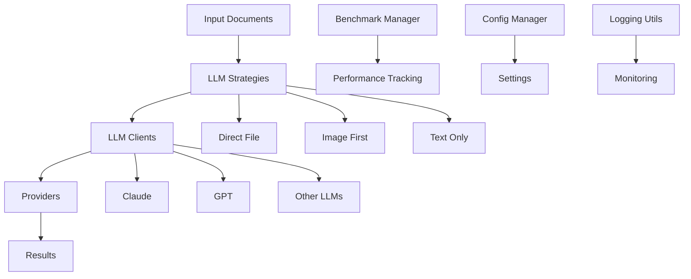

# Ultra Arena Main - Core Processing Engine

The heart of the Ultra Arena platform, providing modular LLM processing capabilities with support for multiple providers and strategies.

## 🏗️ Architecture



## 📁 Directory Structure

| Directory | Purpose | Key Files |
|-----------|---------|-----------|
| **`llm_client/`** | LLM provider integrations | `llm_client_base.py`, `providers/` |
| **`llm_strategies/`** | Document processing strategies | `base_strategy.py`, `direct_file_strategy.py` |
| **`llm_metrics/`** | Token counting and metrics | `llm_token_counter_base.py` |
| **`benchmark/`** | Performance benchmarking | `benchmark_manager.py`, `benchmark_reporter.py` |
| **`config/`** | Configuration management | `config_base.py`, `config_combo_run.py` |
| **`common/`** | Shared utilities | `base_monitor.py`, `combo_meta_manager.py` |
| **`processors/`** | Data processing pipelines | `benchmark_tracker.py`, `checkpoint_manager.py` |
| **`logging_utils/`** | Logging and monitoring | `formatters.py`, `constants.py` |

## 🔧 Core Components

### LLM Clients
```python
# Supported Providers
├── Claude (Anthropic)
├── GPT (OpenAI)
├── DeepSeek
├── Gemini (Google)
└── Custom Providers
```

### Processing Strategies
```python
# Available Strategies
├── Direct File Strategy
├── Image First Strategy
├── Text Only Strategy
└── Custom Strategies
```

## 🚀 Quick Start

### Installation
```bash
pip install -r requirements.txt
```

### Basic Usage
```python
from Ultra_Arena_Main.main_modular import UltraArenaProcessor

# Initialize processor
processor = UltraArenaProcessor()

# Process documents
results = processor.process_documents(
    input_files=["document1.pdf", "document2.pdf"],
    strategy="direct_file",
    provider="claude"
)
```

## 📊 Configuration

### Key Configuration Files

| File | Purpose | Location |
|------|---------|----------|
| `config_base.py` | Base configuration settings | `config/` |
| `config_combo_run.py` | Combo run configurations | `config/` |
| `config_param_grps.py` | Parameter group definitions | `config/` |

### Example Configuration
```python
# config/config_base.py
DEFAULT_TIMEOUT = 300  # 5 minutes
MAX_CONCURRENT_STRATEGIES = 4
DEFAULT_PROVIDER = "claude"
```

## 🔍 API Reference

### Main Processor Class
```python
class UltraArenaProcessor:
    def process_documents(self, input_files, strategy, provider, **kwargs)
    def process_combo(self, combo_definition, **kwargs)
    def benchmark_performance(self, test_config)
```

### Strategy Interface
```python
class BaseStrategy:
    def process(self, documents, **kwargs)
    def validate_input(self, documents)
    def format_output(self, results)
```

## 📈 Performance Monitoring

### Metrics Tracked
- **Processing Time**: Total time per document
- **Token Usage**: Tokens consumed per request
- **Success Rate**: Percentage of successful processing
- **Error Rates**: Detailed error categorization

### Benchmarking
```python
# Run performance benchmark
benchmark_results = processor.benchmark_performance({
    "test_files": ["test1.pdf", "test2.pdf"],
    "strategies": ["direct_file", "image_first"],
    "providers": ["claude", "gpt"],
    "iterations": 5
})
```

## 🧪 Testing

### Unit Tests
```bash
# Run all tests
pytest tests/

# Run specific component tests
pytest tests/test_llm_clients/
pytest tests/test_strategies/
```

### Integration Tests
```bash
# Test with real documents
python -m pytest tests/integration/ -v
```

## 🔧 Development

### Adding New Providers
1. Create provider class in `llm_client/providers/`
2. Implement `BaseLLMClient` interface
3. Add configuration in `config_base.py`
4. Add tests in `tests/test_llm_clients/`

### Adding New Strategies
1. Create strategy class in `llm_strategies/`
2. Implement `BaseStrategy` interface
3. Add strategy configuration
4. Add tests in `tests/test_strategies/`

## 📊 Performance Benchmarks

| Strategy | Avg Processing Time | Success Rate | Token Efficiency |
|----------|-------------------|--------------|------------------|
| Direct File | 45s | 98% | High |
| Image First | 60s | 95% | Medium |
| Text Only | 30s | 99% | Very High |

## 🐛 Troubleshooting

### Common Issues

| Issue | Solution |
|-------|----------|
| Timeout errors | Increase `DEFAULT_TIMEOUT` in config |
| Memory issues | Reduce `MAX_CONCURRENT_STRATEGIES` |
| Provider errors | Check API keys in configuration |
| Strategy failures | Validate input document format |

### Debug Mode
```python
# Enable debug logging
import logging
logging.basicConfig(level=logging.DEBUG)
```

## 📝 Dependencies

Key dependencies from `requirements.txt`:
- `anthropic` - Claude API client
- `openai` - GPT API client
- `fastapi` - Web framework (for REST API)
- `pydantic` - Data validation
- `pytest` - Testing framework

---

For detailed API documentation and examples, see the individual module documentation.
