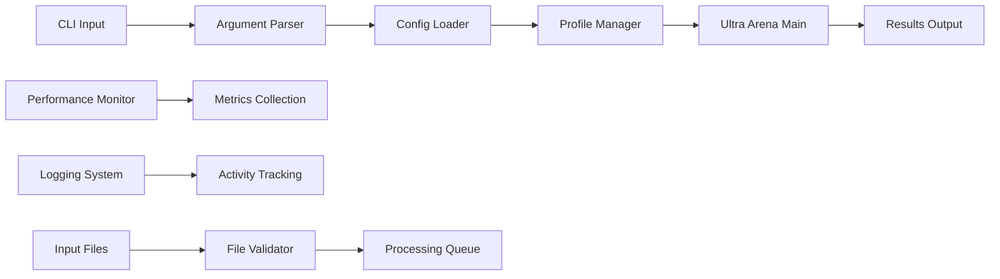

# Ultra Arena CLI - Command Line Interface

A powerful command-line interface for processing documents through the Ultra Arena platform with comprehensive configuration and monitoring capabilities.

## 🏗️ Architecture



## 📁 Directory Structure

| Directory | Purpose | Key Files |
|-----------|---------|-----------|
| **`run_profiles/`** | Profile configurations | `default_profile_cli/` |
| **`performance_measure/`** | Performance monitoring | `cli_wrapper.py`, `core_monitor.py` |
| **`output/`** | Generated results | Results and logs |

## 🚀 Quick Start

### Installation
```bash
pip install -r requirements.txt
```

### Basic Usage
```bash
# Process single file
python main.py --input-file document.pdf --strategy direct_file

# Process multiple files
python main.py --input-dir ./documents --strategy image_first

# Use specific profile
python main.py --profile default_profile_cli --combo-file combo.json
```

## 📊 Command Line Options

| Option | Description | Example |
|--------|-------------|---------|
| `--input-file` | Single file to process | `--input-file doc.pdf` |
| `--input-dir` | Directory of files to process | `--input-dir ./docs/` |
| `--strategy` | Processing strategy | `--strategy direct_file` |
| `--provider` | LLM provider | `--provider claude` |
| `--profile` | Configuration profile | `--profile default_profile_cli` |
| `--combo-file` | Combo definition file | `--combo-file combo.json` |
| `--output-dir` | Output directory | `--output-dir ./results/` |
| `--max-concurrent` | Max concurrent strategies | `--max-concurrent 4` |
| `--timeout` | Processing timeout | `--timeout 300` |

## 🔧 Configuration Profiles

### Profile Structure
```
run_profiles/
└── default_profile_cli/
    ├── profile_config.py      # Main configuration
    └── profile_prompts_config.py  # Prompt templates
```

### Example Profile Configuration
```python
# profile_config.py
DEFAULT_STRATEGY = "direct_file"
DEFAULT_PROVIDER = "claude"
DEFAULT_TIMEOUT = 300
MAX_CONCURRENT_STRATEGIES = 4
OUTPUT_FORMAT = "json"
```

## 📈 Performance Monitoring

### Metrics Tracked
- **Processing Time**: Per file and total
- **Throughput**: Files processed per minute
- **Success Rate**: Percentage of successful processing
- **Resource Usage**: CPU and memory utilization

### Performance Output
```json
{
  "total_files": 10,
  "processed_files": 9,
  "failed_files": 1,
  "total_time": 245.6,
  "avg_time_per_file": 27.3,
  "throughput": 2.4
}
```

## 🧪 Testing

### CLI Test Examples
```bash
# Test with single file
python main.py --input-file test_fixtures/sample.pdf

# Test with combo file
python main.py --combo-file test_fixtures/combo.json

# Performance test
python main.py --input-dir test_fixtures/ --strategy direct_file
```

### Test Fixtures
```
test_fixtures/
├── sample.pdf
├── combo.json
└── input_files/
    ├── 1_file/
    ├── 10_files/
    └── 200_files/
```

## 📊 Usage Examples

### Example 1: Single File Processing
```bash
python main.py \
  --input-file documents/report.pdf \
  --strategy direct_file \
  --provider claude \
  --output-dir results/
```

### Example 2: Batch Processing
```bash
python main.py \
  --input-dir documents/ \
  --strategy image_first \
  --provider gpt \
  --max-concurrent 4 \
  --timeout 600
```

### Example 3: Combo Processing
```bash
python main.py \
  --combo-file combos/benchmark_combo.json \
  --profile default_profile_cli \
  --output-dir results/
```

## 🔍 Advanced Features

### Concurrent Processing
```bash
# Process multiple files concurrently
python main.py --input-dir ./docs --max-concurrent 8
```

### Custom Timeouts
```bash
# Set custom timeout for large files
python main.py --input-file large_doc.pdf --timeout 900
```

### Output Formats
```bash
# JSON output
python main.py --input-file doc.pdf --output-format json

# CSV output
python main.py --input-file doc.pdf --output-format csv
```

## 📊 Performance Benchmarks

| File Count | Strategy | Avg Time | Memory Usage |
|------------|----------|----------|--------------|
| 1 file | Direct File | 45s | 50MB |
| 10 files | Direct File | 6m 30s | 200MB |
| 100 files | Direct File | 1h 15m | 1.2GB |
| 1 file | Image First | 60s | 80MB |
| 10 files | Image First | 8m 45s | 300MB |

## 🐛 Troubleshooting

### Common Issues

| Issue | Solution |
|-------|----------|
| File not found | Check file path and permissions |
| Timeout errors | Increase `--timeout` value |
| Memory errors | Reduce `--max-concurrent` |
| Provider errors | Verify API keys in profile config |
| Strategy errors | Check strategy configuration |

### Debug Mode
```bash
# Enable verbose logging
python main.py --input-file doc.pdf --verbose

# Debug mode with full logging
python main.py --input-file doc.pdf --debug
```

## 📝 Logging

### Log Levels
- **INFO**: General processing information
- **DEBUG**: Detailed processing steps
- **WARNING**: Non-critical issues
- **ERROR**: Processing failures

### Log Output
```
2024-01-15 10:30:15 - INFO - Processing file: document.pdf
2024-01-15 10:30:16 - INFO - Using strategy: direct_file
2024-01-15 10:30:45 - INFO - Processing completed in 30.2s
```

## 🔧 Development

### Adding New Commands
1. Extend argument parser in `main.py`
2. Add command handler function
3. Update help documentation
4. Add tests

### Custom Profiles
1. Create new profile directory in `run_profiles/`
2. Define `profile_config.py`
3. Add prompt templates in `profile_prompts_config.py`
4. Test with `--profile` option

---

For detailed API documentation, see the Ultra_Arena_Main documentation.
