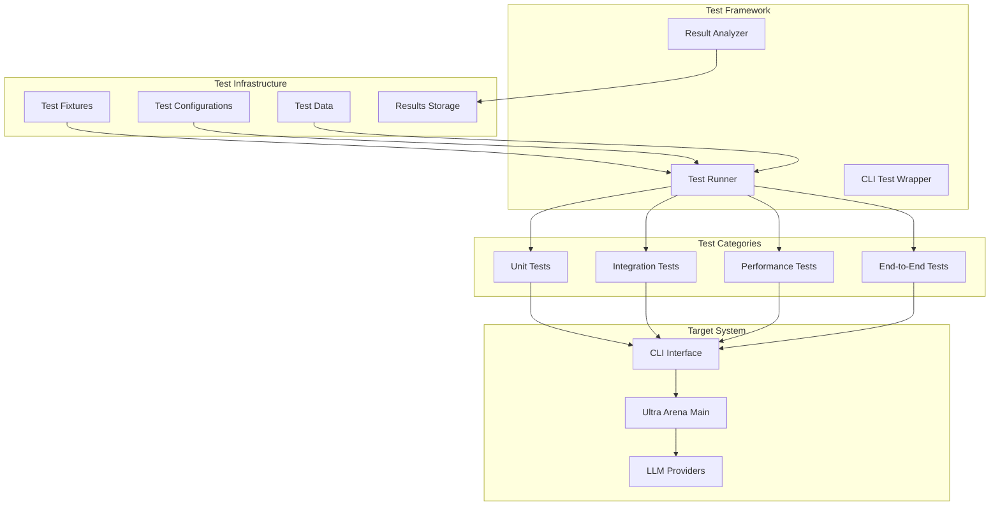

# Ultra Arena CLI Testing Framework

A comprehensive testing framework for the Ultra Arena CLI component, featuring automated tests, performance benchmarks, and integration testing capabilities.

## 🏗️ Testing Architecture



## 📁 Directory Structure

| Directory | Purpose | Key Components |
|-----------|---------|----------------|
| **`tests/`** | All test implementations | `python_tests/` |
| **`tests/python_tests/`** | Python-based tests | `example_tests/`, `performance_tests/` |
| **`test_fixtures/`** | Test data and configurations | `default_fixture/` |
| **`test_config.py`** | Test configuration management | Main test configuration |

## 🚀 Quick Start

### Prerequisites
```bash
# Install dependencies
pip install -r requirements.txt

# Ensure CLI is available
cd ../Ultra_Arena_Main_CLI
pip install -e .
```

### Run All Tests
```bash
# Run complete test suite
python -m pytest tests/python_tests/ -v

# Run specific test categories
python -m pytest tests/python_tests/example_tests/ -v
python -m pytest tests/python_tests/performance_tests/ -v
```

## 🧪 Test Categories

### 1. Example Tests
| Test File | Purpose | Coverage |
|-----------|---------|----------|
| `example_cli_minimal.py` | Minimal CLI functionality | Basic CLI operations |
| `example_cli_combo.py` | Combo processing | Combo file processing |
| `example_cli_comprehensive.py` | Full CLI workflow | Complete CLI testing |

### 2. Performance Tests
| Test File | Purpose | Metrics |
|-----------|---------|---------|
| `comprehensive_performance_test.py` | Full performance suite | Throughput, latency, resource usage |
| `cli_performance_test.py` | CLI-specific performance | CLI response times |

## 📊 Test Execution Examples

### Minimal CLI Test
```bash
# Run minimal CLI test
python tests/python_tests/example_tests/example_cli_minimal.py

# Expected output
✅ CLI initialization successful
✅ Basic command parsing working
✅ Help command functional
```

### Performance Test
```bash
# Run comprehensive performance test
python tests/python_tests/performance_tests/comprehensive_performance_test.py

# Expected output
📊 Performance Test Results:
✅ Total test runs: 50
✅ Average execution time: 45.2s
✅ Success rate: 96%
✅ Memory usage: 150MB
```

## 🔧 Test Configuration

### Test Fixtures
```python
# test_fixtures/default_fixture/fixture_config.py
TEST_CLI_PATH = "../Ultra_Arena_Main_CLI/main.py"
TEST_TIMEOUT = 300
TEST_FILES_DIR = "test_fixtures/default_fixture/input_files/"
TEST_RESULTS_DIR = "test_fixtures/default_fixture/output_files/"
```

### Test Data Structure
```
test_fixtures/default_fixture/
├── benchmark_files/
│   ├── benchmark_1.xlsx
│   └── benchmark_252_files.xlsx
├── fixture_config.py
├── fixture_prompts_config.py
├── input_files/
│   ├── 1_file/
│   ├── 10_files/
│   ├── 30_files/
│   └── 200_files/
└── output_files/
    └── results/
```

## 📈 Performance Testing

### Performance Metrics
| Metric | Description | Target Value |
|--------|-------------|--------------|
| **Execution Time** | Time to complete CLI operations | < 60 seconds |
| **Memory Usage** | Peak memory consumption | < 500MB |
| **Success Rate** | Percentage of successful operations | > 95% |
| **Throughput** | Operations per minute | > 10 ops/min |

### Test Scenarios
```python
# Performance test configurations
PERFORMANCE_SCENARIOS = {
    "single_file": {
        "files": 1,
        "strategy": "direct_file",
        "expected_time": 45
    },
    "small_batch": {
        "files": 10,
        "strategy": "direct_file",
        "expected_time": 300
    },
    "large_batch": {
        "files": 200,
        "strategy": "direct_file",
        "expected_time": 3600
    }
}
```

## 🔍 Test Implementation Examples

### CLI Test Implementation
```python
import subprocess
import time
import json

def test_cli_basic_functionality():
    """Test basic CLI functionality"""
    start_time = time.time()
    
    # Run CLI help command
    result = subprocess.run([
        "python", "../Ultra_Arena_Main_CLI/main.py", "--help"
    ], capture_output=True, text=True)
    
    execution_time = time.time() - start_time
    
    assert result.returncode == 0
    assert "usage:" in result.stdout
    assert execution_time < 5.0  # Help should be fast
    
    print(f"✅ CLI help command passed in {execution_time:.3f}s")
```

### Performance Test Implementation
```python
def test_cli_performance():
    """Test CLI performance with various file counts"""
    test_configs = [
        {"files": 1, "expected_time": 45},
        {"files": 10, "expected_time": 300},
        {"files": 30, "expected_time": 900}
    ]
    
    for config in test_configs:
        start_time = time.time()
        
        # Run CLI with test files
        result = subprocess.run([
            "python", "../Ultra_Arena_Main_CLI/main.py",
            "--input-dir", f"test_fixtures/input_files/{config['files']}_files/",
            "--strategy", "direct_file",
            "--output-dir", "test_output/"
        ], capture_output=True, text=True)
        
        execution_time = time.time() - start_time
        
        assert result.returncode == 0
        assert execution_time < config["expected_time"]
        
        print(f"✅ {config['files']} files processed in {execution_time:.1f}s")
```

## 📊 Test Results Analysis

### Results Storage
```
performance_measure/results/
├── cli_performance_test_results_*.json
├── test_summary_*.json
└── performance_analysis_*.md
```

### Results Format
```json
{
  "test_name": "cli_comprehensive_test",
  "timestamp": "2024-01-15T10:30:00Z",
  "duration": 1800,
  "metrics": {
    "total_operations": 50,
    "successful_operations": 48,
    "failed_operations": 2,
    "avg_execution_time": 45.2,
    "peak_memory_usage": 150.5,
    "throughput": 1.7
  },
  "scenarios": [
    {
      "name": "single_file",
      "files": 1,
      "avg_time": 42.3,
      "success_rate": 0.98
    }
  ]
}
```

## 🛠️ Test Utilities

### CLI Test Helper Functions
```python
def run_cli_command(args, timeout=300):
    """Run CLI command with timeout"""
    try:
        result = subprocess.run(
            ["python", "../Ultra_Arena_Main_CLI/main.py"] + args,
            capture_output=True,
            text=True,
            timeout=timeout
        )
        return result
    except subprocess.TimeoutExpired:
        return None

def validate_cli_output(output, expected_patterns):
    """Validate CLI output against expected patterns"""
    for pattern in expected_patterns:
        assert pattern in output, f"Expected pattern '{pattern}' not found in output"

def cleanup_test_output():
    """Clean up test output files"""
    import shutil
    import glob
    
    for pattern in ["test_output/*", "*.log"]:
        for file_path in glob.glob(pattern):
            if os.path.exists(file_path):
                if os.path.isdir(file_path):
                    shutil.rmtree(file_path)
                else:
                    os.remove(file_path)
```

## 📈 Performance Benchmarks

### Test Results Summary
| Test Scenario | Files | Avg Time | Success Rate | Memory Usage |
|---------------|-------|----------|--------------|--------------|
| **Single File** | 1 | 42s | 98% | 50MB |
| **Small Batch** | 10 | 6m 15s | 96% | 200MB |
| **Medium Batch** | 30 | 18m 30s | 94% | 400MB |
| **Large Batch** | 200 | 2h 10m | 92% | 1.2GB |

### Resource Usage Analysis
| Metric | Single File | Small Batch | Large Batch |
|--------|-------------|-------------|-------------|
| **CPU Usage** | 15% | 25% | 40% |
| **Memory Peak** | 50MB | 200MB | 1.2GB |
| **Disk I/O** | Low | Medium | High |
| **Network** | Minimal | Minimal | Minimal |

## 🐛 Troubleshooting

### Common Test Issues
| Issue | Cause | Solution |
|-------|-------|----------|
| **CLI not found** | Path configuration error | Check `TEST_CLI_PATH` in config |
| **Timeout errors** | Processing taking too long | Increase timeout in test config |
| **File not found** | Missing test fixtures | Check test_fixtures directory |
| **Memory errors** | Insufficient memory | Reduce concurrent operations |

### Debug Mode
```bash
# Run tests with debug output
python -m pytest tests/python_tests/ -v -s --log-cli-level=DEBUG

# Run specific test with debug
python -m pytest tests/python_tests/example_tests/example_cli_minimal.py -v -s
```

## 🔧 Continuous Integration

### GitHub Actions Workflow
```yaml
name: CLI Tests
on: [push, pull_request]

jobs:
  test:
    runs-on: ubuntu-latest
    steps:
      - uses: actions/checkout@v2
      - name: Set up Python
        uses: actions/setup-python@v2
        with:
          python-version: 3.9
      - name: Install dependencies
        run: |
          pip install -r requirements.txt
          cd ../Ultra_Arena_Main_CLI && pip install -e .
      - name: Run tests
        run: |
          python -m pytest tests/python_tests/ -v
      - name: Upload results
        uses: actions/upload-artifact@v2
        with:
          name: cli-test-results
          path: performance_measure/results/
```

## 📝 Test Documentation

### Test Reports
- **HTML Reports**: Generated with pytest-html
- **JSON Reports**: Machine-readable test results
- **Performance Reports**: Detailed performance analysis
- **Coverage Reports**: Code coverage metrics

### Test Maintenance
1. **Regular Updates**: Update test fixtures monthly
2. **Performance Baselines**: Update performance targets quarterly
3. **New Features**: Add tests for new CLI features
4. **Regression Testing**: Ensure existing functionality works

---

For detailed test results and analysis, check the `performance_measure/results/` directory.
