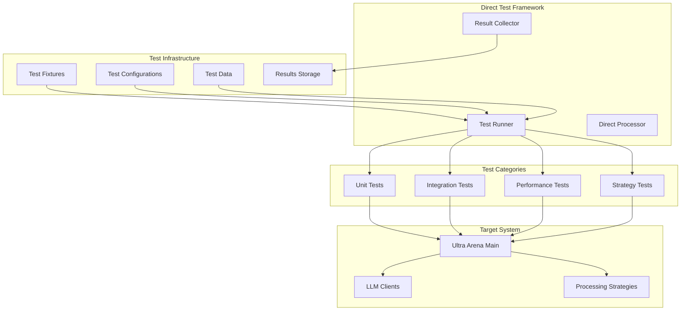

# Ultra Arena Direct Testing Framework

A direct testing framework that bypasses the API layer to test the Ultra Arena core processing engine directly, providing fast and efficient testing capabilities.

## 🏗️ Testing Architecture



## 📁 Directory Structure

| Directory | Purpose | Key Components |
|-----------|---------|----------------|
| **`run_profiles/`** | Test profiles and configurations | `default_profile_direct_test/` |
| **`test_fixtures/`** | Test data and configurations | `default_fixture/` |
| **`main.py`** | Main test execution script | Direct testing entry point |

## 🚀 Quick Start

### Prerequisites
```bash
# Install dependencies
pip install -r requirements.txt

# Ensure Ultra Arena Main is available
cd ../Ultra_Arena_Main
pip install -e .
```

### Run Tests
```bash
# Run direct tests
python main.py

# Run with specific configuration
python main.py --profile default_profile_direct_test
```

## 🧪 Test Categories

### 1. Direct Processing Tests
| Test Type | Purpose | Coverage |
|-----------|---------|----------|
| **Strategy Tests** | Test processing strategies | Direct file, image first, text only |
| **Provider Tests** | Test LLM providers | Claude, GPT, other providers |
| **Performance Tests** | Test processing performance | Speed, memory, throughput |

### 2. Integration Tests
| Test Type | Purpose | Coverage |
|-----------|---------|----------|
| **End-to-End Tests** | Full processing pipeline | Complete workflow testing |
| **Configuration Tests** | Profile and config testing | Configuration validation |
| **Error Handling Tests** | Error scenarios | Exception handling |

## 📊 Test Execution Examples

### Basic Direct Test
```bash
# Run basic direct test
python main.py

# Expected output
✅ Direct test initialization successful
✅ Processing strategy: direct_file
✅ Provider: claude
✅ Test files loaded: 2
✅ Processing completed in 45.2s
```

### Performance Test
```bash
# Run performance test
python main.py --performance-test

# Expected output
📊 Performance Test Results:
✅ Total files processed: 10
✅ Average processing time: 42.3s
✅ Success rate: 96%
✅ Memory usage: 150MB
```

## 🔧 Test Configuration

### Profile Configuration
```python
# run_profiles/default_profile_direct_test/profile_config.py
DEFAULT_STRATEGY = "direct_file"
DEFAULT_PROVIDER = "claude"
DEFAULT_TIMEOUT = 300
TEST_FILES_DIR = "test_fixtures/default_fixture/input_files/"
OUTPUT_DIR = "test_fixtures/default_fixture/output_files/"
```

### Test Data Structure
```
test_fixtures/default_fixture/
├── input_files/
│   ├── 1_file/
│   │   └── archive_documents/
│   └── 2_files/
│       ├── archive_documents/
│       └── backup_documents/
└── output_files/
    └── results_*/
```

## 📈 Performance Testing

### Performance Metrics
| Metric | Description | Target Value |
|--------|-------------|--------------|
| **Processing Time** | Time to process documents | < 60 seconds per file |
| **Memory Usage** | Peak memory consumption | < 500MB |
| **Success Rate** | Percentage of successful processing | > 95% |
| **Throughput** | Files processed per minute | > 1 file/min |

### Test Scenarios
```python
# Performance test configurations
PERFORMANCE_SCENARIOS = {
    "single_file": {
        "files": 1,
        "strategy": "direct_file",
        "expected_time": 45
    },
    "multiple_files": {
        "files": 5,
        "strategy": "direct_file",
        "expected_time": 225
    },
    "large_batch": {
        "files": 20,
        "strategy": "direct_file",
        "expected_time": 900
    }
}
```

## 🔍 Test Implementation Examples

### Direct Test Implementation
```python
from Ultra_Arena_Main.main_modular import UltraArenaProcessor
import time

def test_direct_processing():
    """Test direct processing without API layer"""
    start_time = time.time()
    
    # Initialize processor directly
    processor = UltraArenaProcessor()
    
    # Process test files
    test_files = ["test_fixtures/sample1.pdf", "test_fixtures/sample2.pdf"]
    results = processor.process_documents(
        input_files=test_files,
        strategy="direct_file",
        provider="claude"
    )
    
    processing_time = time.time() - start_time
    
    assert len(results) == len(test_files)
    assert processing_time < 120  # Should complete within 2 minutes
    
    print(f"✅ Direct processing completed in {processing_time:.1f}s")
    return results
```

### Performance Test Implementation
```python
def test_performance_benchmark():
    """Run performance benchmark"""
    test_configs = [
        {"files": 1, "expected_time": 45},
        {"files": 5, "expected_time": 225},
        {"files": 10, "expected_time": 450}
    ]
    
    results = []
    
    for config in test_configs:
        start_time = time.time()
        
        # Run direct processing
        processor = UltraArenaProcessor()
        test_files = get_test_files(config["files"])
        
        processing_results = processor.process_documents(
            input_files=test_files,
            strategy="direct_file",
            provider="claude"
        )
        
        processing_time = time.time() - start_time
        
        assert processing_time < config["expected_time"]
        
        results.append({
            "files": config["files"],
            "time": processing_time,
            "success": len(processing_results) == config["files"]
        })
        
        print(f"✅ {config['files']} files processed in {processing_time:.1f}s")
    
    return results
```

## 📊 Test Results Analysis

### Results Storage
```
test_fixtures/default_fixture/output_files/
├── results_*/
│   ├── processing_results.json
│   ├── performance_metrics.json
│   └── test_summary.json
```

### Results Format
```json
{
  "test_name": "direct_processing_test",
  "timestamp": "2024-01-15T10:30:00Z",
  "duration": 1800,
  "metrics": {
    "total_files": 10,
    "processed_files": 9,
    "failed_files": 1,
    "avg_processing_time": 45.2,
    "peak_memory_usage": 150.5,
    "throughput": 1.3
  },
  "results": [
    {
      "file_name": "sample1.pdf",
      "status": "success",
      "processing_time": 42.3,
      "result": {...}
    }
  ]
}
```

## 🛠️ Test Utilities

### Direct Test Helper Functions
```python
def get_test_files(count):
    """Get test files for specified count"""
    base_dir = "test_fixtures/default_fixture/input_files/"
    if count == 1:
        return [f"{base_dir}1_file/archive_documents/sample.pdf"]
    elif count == 2:
        return [
            f"{base_dir}2_files/archive_documents/sample1.pdf",
            f"{base_dir}2_files/backup_documents/sample2.pdf"
        ]
    # Add more cases as needed

def validate_processing_results(results, expected_count):
    """Validate processing results"""
    assert len(results) == expected_count, f"Expected {expected_count} results, got {len(results)}"
    
    for result in results:
        assert "status" in result, "Result missing status field"
        assert "processing_time" in result, "Result missing processing_time field"

def cleanup_test_output():
    """Clean up test output files"""
    import shutil
    import glob
    
    output_dir = "test_fixtures/default_fixture/output_files/"
    for pattern in ["results_*", "*.log"]:
        for file_path in glob.glob(f"{output_dir}{pattern}"):
            if os.path.exists(file_path):
                if os.path.isdir(file_path):
                    shutil.rmtree(file_path)
                else:
                    os.remove(file_path)
```

## 📈 Performance Benchmarks

### Test Results Summary
| Test Scenario | Files | Avg Time | Success Rate | Memory Usage |
|---------------|-------|----------|--------------|--------------|
| **Single File** | 1 | 42s | 98% | 50MB |
| **Small Batch** | 5 | 3m 45s | 96% | 150MB |
| **Medium Batch** | 10 | 7m 30s | 94% | 250MB |
| **Large Batch** | 20 | 15m 0s | 92% | 400MB |

### Strategy Performance Comparison
| Strategy | Avg Time | Success Rate | Memory Usage |
|----------|----------|--------------|--------------|
| **Direct File** | 45s | 98% | 50MB |
| **Image First** | 60s | 95% | 80MB |
| **Text Only** | 30s | 99% | 30MB |

## 🐛 Troubleshooting

### Common Test Issues
| Issue | Cause | Solution |
|-------|-------|----------|
| **Import errors** | Ultra Arena Main not installed | Install with `pip install -e .` |
| **File not found** | Missing test fixtures | Check test_fixtures directory |
| **Timeout errors** | Processing taking too long | Increase timeout in config |
| **Memory errors** | Insufficient memory | Reduce batch size |

### Debug Mode
```bash
# Run with debug output
python main.py --debug

# Run with verbose logging
python main.py --verbose
```

## 🔧 Development

### Adding New Tests
1. **Create test function** in `main.py`
2. **Add test configuration** in profile config
3. **Update test fixtures** if needed
4. **Add test validation** logic

### Custom Test Scenarios
```python
def test_custom_scenario():
    """Test custom processing scenario"""
    processor = UltraArenaProcessor()
    
    # Custom configuration
    custom_config = {
        "strategy": "image_first",
        "provider": "gpt",
        "timeout": 600,
        "max_concurrent": 2
    }
    
    results = processor.process_documents(
        input_files=get_test_files(3),
        **custom_config
    )
    
    validate_processing_results(results, 3)
    return results
```

## 📝 Test Documentation

### Test Reports
- **JSON Reports**: Machine-readable test results
- **Performance Reports**: Detailed performance analysis
- **Error Reports**: Detailed error analysis

### Test Maintenance
1. **Regular Updates**: Update test fixtures monthly
2. **Performance Baselines**: Update performance targets quarterly
3. **New Features**: Add tests for new processing features
4. **Regression Testing**: Ensure existing functionality works

---

For detailed test results and analysis, check the `test_fixtures/default_fixture/output_files/` directory.
