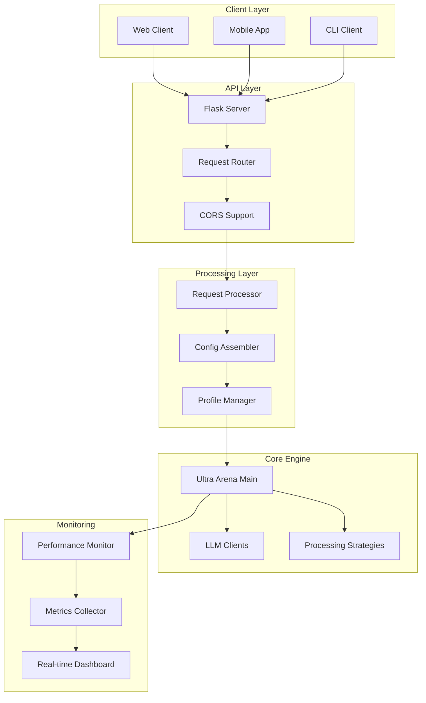

# Ultra Arena REST API Server

A REST API server built with Flask that provides web-based access to the Ultra Arena document processing platform. Features API endpoints for document processing and combo operations.

## 🏗️ Architecture Overview



## 📁 Directory Structure

| Directory | Purpose | Key Components |
|-----------|---------|----------------|
| **`server_utils/`** | Core server implementation | `server.py`, `request_processor.py` |
| **`server_utils/config_assemblers/`** | Configuration management | `base_config_assembler.py`, `config_models.py` |
| **`run_profiles/`** | API profiles and configurations | `default_profile_restful/` |
| **`performance_measure/`** | Performance monitoring | `core_monitor.py`, `rest_wrapper.py` |
| **`cursor_gen/`** | Generated documentation | Implementation notes |

## 🚀 Quick Start

### Installation
```bash
pip install -r requirements.txt
```

### Start Server
```bash
# Development mode
python server.py

# Production mode
python server.py
```

### Server Configuration
```python
# Default settings
HOST = "0.0.0.0"
PORT = 8000
DEBUG = False
```

## 🔌 API Endpoints

### Core Endpoints

| Endpoint | Method | Description | Parameters |
|----------|--------|-------------|------------|
| `/health` | GET | Server health check | None |
| `/api/process/combo` | POST | Process files with specific combo (synchronous) | `combo_name`, `input_pdf_dir_path`, `output_dir` |
| `/api/process/combo/async` | POST | Process files with specific combo (asynchronous) | `combo_name`, `input_pdf_dir_path`, `output_dir` |
| `/api/requests/<request_id>` | GET | Get async request status | `request_id` (path parameter) |
| `/api/requests` | GET | Get all async requests | None |
| `/api/combos` | GET | Get available combos | None |

### Health Check
```bash
curl -X GET "http://localhost:8000/health"
```

**Response:**
```json
{
  "status": "healthy",
  "service": "Ultra Arena Main RESTful API",
  "version": "1.0.0"
}
```

### Get Available Combos
```bash
curl -X GET "http://localhost:8000/api/combos"
```

**Response:**
```json
{
  "status": "success",
  "combos": [
    {
      "id": "benchmark_combo",
      "name": "Benchmark Processing",
      "description": "Standard benchmark processing combo"
    }
  ],
  "count": 1
}
```


## 📤 Request/Response Examples

### Synchronous Process Files Request
```bash
curl -X POST "http://localhost:8000/api/process/combo" \
  -H "Content-Type: application/json" \
  -d '{
    "combo_name": "combo_test_10_strategies",
    "input_pdf_dir_path": "/path/to/input",
    "output_dir": "/path/to/output"
  }'
```

**Request Body:**
```json
{
  "combo_name": "combo_test_10_strategies",
  "input_pdf_dir_path": "/path/to/input",
  "output_dir": "/path/to/output",
  "run_type": "normal",
  "streaming": false,
  "max_cc_strategies": 3,
  "max_cc_filegroups": 5,
  "max_files_per_request": 10
}
```

### Asynchronous Process Files Request
```bash
curl -X POST "http://localhost:8000/api/process/combo/async" \
  -H "Content-Type: application/json" \
  -d '{
    "combo_name": "combo_test_10_strategies",
    "input_pdf_dir_path": "/path/to/input",
    "output_dir": "/path/to/output"
  }'
```

**Response (HTTP 202 Accepted):**
```json
{
  "status": "accepted",
  "request_id": "req_20241215_143022_abc123def456",
  "combo_name": "combo_test_10_strategies",
  "benchmark_eval_mode": false,
  "input_pdf_dir_path": "/path/to/input",
  "output_dir": "/path/to/output",
  "benchmark_file_path": null,
  "prompt": {
    "prompt_configuration": {
      "system_prompt": {
        "value": "You are a helpful assistant...",
        "source": "profile_config"
      }
    },
    "summary": {
      "total_prompts": 1,
      "sources_used": ["profile_config"]
    }
  },
  "request_id": "req_20241215_143022_abc123def456",
  "request_mechanism": "rest",
  "request_start_time": "2024-12-15T14:30:22.123456Z",
  "utc_timezone": "UTC",
  "num_files_to_process": 5,
  "num_strategies": 10,
  "strategy_groups": [
    "grp_directF_google_gemini25_para",
    "grp_imageF_google_gemini25_para"
  ],
  "message": "Request accepted for processing. Use GET /api/requests/{request_id} to check status."
}
```

### Check Request Status
```bash
curl -X GET "http://localhost:8000/api/requests/req_20241215_143022_abc123def456"
```

**Progress Calculation:**
- Progress is calculated as: `(completed_work_units / total_work_units) * 100`
- `total_work_units = num_files_to_process × num_strategies`
- `completed_work_units = actual files processed × strategies completed`

**Status Values:**
- `"processing"` - Request is being processed
- `"incomplete"` - Processing finished but progress < 100%
- `"complete"` - Processing finished with progress = 100%
- `"failed"` - Processing failed with error

**Response (Processing):**
```json
{
  "status": "processing",
  "request_id": "req_20241215_143022_abc123def456",
  "created_at": "2024-12-15T14:30:22.123456Z",
  "progress": 45,
  "total_work_units": 50,
  "completed_work_units": 22
}
```

**Response (Incomplete):**
```json
{
  "status": "incomplete",
  "request_id": "req_20241215_143022_abc123def456",
  "created_at": "2024-12-15T14:30:22.123456Z",
  "progress": 85,
  "total_work_units": 50,
  "completed_work_units": 42
}
```

**Response (Complete):**
```json
{
  "status": "complete",
  "request_id": "req_20241215_143022_abc123def456",
  "created_at": "2024-12-15T14:30:22.123456Z",
  "completed_at": "2024-12-15T14:32:15.789012Z",
  "progress": 100,
  "total_work_units": 50,
  "completed_work_units": 50,
  "performance": {
    "configuration_assembly_time_ms": 45.2,
    "server_config_cached": true
  },
  "results": {
    "status": "completed",
    "total_files_processed": 5,
    "successful_files": 5,
    "failed_files": 0,
    "processing_time_seconds": 120.5,
    "total_cost_usd": 0.045,
    "strategies_executed": [
      "grp_directF_google_gemini25_para",
      "grp_imageF_google_gemini25_para"
    ],
    "output_files": [
      "/path/to/output/results_20241215_143022_abc123/results.json",
      "/path/to/output/results_20241215_143022_abc123/performance_summary.json"
    ]
  }
}
```


## 🔧 Configuration

### Profile Configuration
```python
# run_profiles/default_profile_restful/profile_config.py
DEFAULT_STRATEGY = "direct_file"
DEFAULT_PROVIDER = "claude"
DEFAULT_TIMEOUT = 300
MAX_CONCURRENT_STRATEGIES = 4
API_RATE_LIMIT = 100  # requests per minute
```


## 📈 Performance Monitoring

### Real-time Metrics
- **Request Rate**: Requests per second
- **Response Time**: Average response time
- **Error Rate**: Percentage of failed requests
- **Active Connections**: Current active connections
- **Queue Length**: Pending requests in queue


## 🧪 Testing

### API Testing
```bash
# Health check
curl -X GET "http://localhost:8000/health"

# Process test files
curl -X POST "http://localhost:8000/api/process/combo" \
  -H "Content-Type: application/json" \
  -d '{
    "combo_name": "combo_test_10_strategies",
    "input_pdf_dir_path": "/path/to/test/input",
    "output_dir": "/path/to/test/output"
  }'
```


## 🐛 Error Handling

### Error Response Format
```json
{
  "error": {
    "code": "VALIDATION_ERROR",
    "message": "Invalid file format",
    "details": {
      "field": "files",
      "issue": "Unsupported file type"
    }
  },
  "timestamp": "2024-01-15T10:30:00Z",
  "request_id": "req_123456789"
}
```

### Common Error Codes
| Code | Description | HTTP Status |
|------|-------------|-------------|
| `VALIDATION_ERROR` | Invalid request parameters | 400 |
| `FILE_TOO_LARGE` | File exceeds size limit | 413 |
| `UNSUPPORTED_FORMAT` | Unsupported file format | 400 |
| `PROCESSING_ERROR` | Document processing failed | 500 |
| `TIMEOUT_ERROR` | Request timeout | 408 |
| `RATE_LIMIT_EXCEEDED` | Too many requests | 429 |

## 📊 Performance Benchmarks

| Metric | Value | Notes |
|--------|-------|-------|
| **Requests/sec** | 50 | Single worker |
| **Concurrent Users** | 100 | 4 workers |
| **Response Time** | 45ms | Health check |
| **File Processing** | 30s | 1MB PDF |
| **Memory Usage** | 200MB | Base usage |
| **CPU Usage** | 15% | Idle state |

## 🔧 Development

### Adding New Endpoints
1. Define endpoint in `server.py`
2. Create request/response models
3. Implement business logic
4. Add error handling
5. Write tests


### Environment Variables
```bash
# Server configuration
HOST=0.0.0.0
PORT=8000
DEBUG=false
```

## 📝 Logging

### Log Format
```
2024-01-15 10:30:15.123 - INFO - [ThreadPoolExecutor-0_0][process_combo] - Processing combo: benchmark_combo
2024-01-15 10:30:15.456 - INFO - [ThreadPoolExecutor-0_0][process_combo] - Files received: 2
2024-01-15 10:30:45.789 - INFO - [ThreadPoolExecutor-0_0][process_combo] - Processing completed in 30.6s
```

### Log Levels
- **DEBUG**: Detailed processing information
- **INFO**: General API operations
- **WARNING**: Non-critical issues
- **ERROR**: API errors and failures

## 🚀 Deployment

### Production Deployment
```bash
# Using Python directly
python server.py

# Using systemd
sudo systemctl start ultra-arena-restful
sudo systemctl enable ultra-arena-restful
```

---

For detailed API documentation, check the server.py file for available endpoints.
