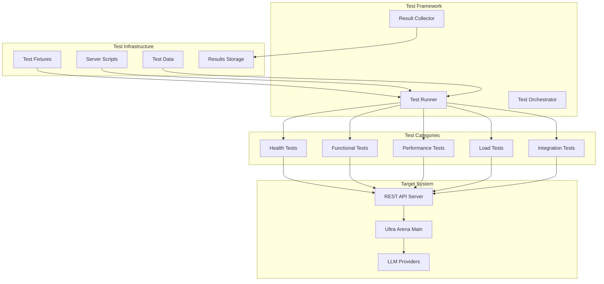

# Ultra Arena REST API Testing Suite

A comprehensive testing framework for the Ultra Arena REST API server, featuring automated tests, performance benchmarks, load testing, and integration testing capabilities.

## 🏗️ Testing Architecture



## 📁 Directory Structure

| Directory | Purpose | Key Components |
|-----------|---------|----------------|
| **`tests/`** | All test implementations | `python_tests/`, `curl_tests/` |
| **`tests/python_tests/`** | Python-based tests | `health_tests/`, `functional_tests/`, `performance_tests/` |
| **`tests/curl_tests/`** | Shell-based API tests | `simple_test_*.sh` |
| **`test_fixtures/`** | Test data and configurations | `default_fixture/` |
| **`rest_server_start_scripts/`** | Server management scripts | `start_server.sh`, `stop_server.sh` |
| **`cursor_gen/`** | Generated test documentation | Test results and analysis |

## 🚀 Quick Start

### Prerequisites
```bash
# Install dependencies
pip install -r requirements.txt

# Ensure REST server is running
cd ../Ultra_Arena_Main_Restful
python server.py
```

### Run All Tests
```bash
# Run complete test suite
python -m pytest tests/python_tests/ -v

# Run specific test categories
python -m pytest tests/python_tests/health_tests/ -v
python -m pytest tests/python_tests/functional_tests/ -v
python -m pytest tests/python_tests/performance_tests/ -v
```

## 🧪 Test Categories

### 1. Health Tests
| Test File | Purpose | Endpoints Tested |
|-----------|---------|------------------|
| `simple_test_health.py` | Basic server health | `/health` |
| `simple_test_get_combos.py` | Combo listing | `/api/combos` |

### 2. Functional Tests
| Test File | Purpose | Coverage |
|-----------|---------|----------|
| `simple_test_process_combo.py` | Combo processing | Full combo workflow |
| `simple_test_process_files.py` | Direct file processing | File upload and processing |
| `test_br_profile_combo.py` | Profile-specific testing | BR profile functionality |
| `test_evaluation_combo.py` | Evaluation workflows | Evaluation processing |
| `test_profile_switcher.py` | Profile switching | Dynamic profile management |

### 3. Performance Tests
| Test File | Purpose | Metrics |
|-----------|---------|---------|
| `comprehensive_performance_test.py` | Full performance suite | Throughput, latency, error rates |
| `test_4_files_performance.py` | Specific file count testing | 4-file processing performance |

## 📊 Test Execution Examples

### Health Check Test
```bash
# Run health test
python tests/python_tests/health_tests/simple_test_health.py

# Expected output
✅ Health check passed
✅ Server is responding
✅ Response time: 45ms
```

### Functional Test
```bash
# Run combo processing test
python tests/python_tests/functional_tests/simple_test_process_combo.py

# Expected output
✅ Combo processing test passed
✅ Files processed: 2/2
✅ Processing time: 65.2s
✅ Results saved to: output/results_*.json
```

### Performance Test
```bash
# Run comprehensive performance test
python tests/python_tests/performance_tests/comprehensive_performance_test.py

# Expected output
📊 Performance Test Results:
✅ Total requests: 50
✅ Success rate: 96%
✅ Average response time: 2.3s
✅ Throughput: 21.7 requests/min
```

## 🔧 Test Configuration

### Test Fixtures
```python
# test_fixtures/default_fixture/fixture_config.py
TEST_SERVER_URL = "http://localhost:8000"
TEST_TIMEOUT = 300
TEST_FILES_DIR = "test_fixtures/default_fixture/input_files/"
TEST_RESULTS_DIR = "test_fixtures/default_fixture/output_files/"
```

### Test Data Structure
```
test_fixtures/default_fixture/
├── benchmark_files/
│   └── benchmark_200.csv
├── fixture_config.py
├── fixture_prompts_config.py
├── input_files/
│   ├── 1_file/
│   ├── 10_files/
│   ├── 30_files/
│   └── 200_files/
└── output_files/
    └── results_*/
```

## 📈 Performance Testing

### Performance Metrics
| Metric | Description | Target Value |
|--------|-------------|--------------|
| **Response Time** | Average API response time | < 5 seconds |
| **Throughput** | Requests processed per minute | > 20 requests/min |
| **Success Rate** | Percentage of successful requests | > 95% |
| **Error Rate** | Percentage of failed requests | < 5% |
| **Concurrent Users** | Maximum concurrent users supported | > 50 users |

### Load Testing Scenarios
```python
# Load test configurations
LOAD_TEST_CONFIGS = {
    "light_load": {
        "users": 10,
        "duration": 60,
        "ramp_up": 10
    },
    "medium_load": {
        "users": 50,
        "duration": 120,
        "ramp_up": 30
    },
    "heavy_load": {
        "users": 100,
        "duration": 300,
        "ramp_up": 60
    }
}
```

## 🔍 Test Implementation Examples

### Health Test Implementation
```python
import requests
import time

def test_health_check():
    """Test server health endpoint"""
    start_time = time.time()
    
    response = requests.get(f"{TEST_SERVER_URL}/health")
    response_time = time.time() - start_time
    
    assert response.status_code == 200
    assert response.json()["status"] == "healthy"
    assert response_time < 1.0  # Response within 1 second
    
    print(f"✅ Health check passed in {response_time:.3f}s")
```

### Functional Test Implementation
```python
def test_process_combo():
    """Test combo processing workflow"""
    combo_id = "benchmark_combo"
    test_files = ["test_fixtures/sample1.pdf", "test_fixtures/sample2.pdf"]
    
    # Prepare multipart form data
    files = [("files", open(f, "rb")) for f in test_files]
    data = {"combo_id": combo_id}
    
    response = requests.post(
        f"{TEST_SERVER_URL}/process-combo",
        files=files,
        data=data
    )
    
    assert response.status_code == 200
    result = response.json()
    assert result["status"] in ["processing", "completed"]
    assert result["files_count"] == len(test_files)
```

### Performance Test Implementation
```python
def test_performance_benchmark():
    """Run comprehensive performance benchmark"""
    test_config = {
        "iterations": 10,
        "concurrent_requests": 5,
        "test_files": ["sample1.pdf", "sample2.pdf"],
        "strategies": ["direct_file", "image_first"]
    }
    
    results = run_performance_test(test_config)
    
    # Assert performance requirements
    assert results["avg_response_time"] < 5.0
    assert results["success_rate"] > 0.95
    assert results["throughput"] > 20
    
    save_performance_results(results)
```

## 📊 Test Results Analysis

### Results Storage
```
performance_measure/results/
├── rest_performance_summary_*.json
├── test_results_*.json
└── performance_analysis_*.md
```

### Results Format
```json
{
  "test_name": "comprehensive_performance_test",
  "timestamp": "2024-01-15T10:30:00Z",
  "duration": 1800,
  "metrics": {
    "total_requests": 100,
    "successful_requests": 96,
    "failed_requests": 4,
    "avg_response_time": 2.3,
    "min_response_time": 0.8,
    "max_response_time": 8.5,
    "throughput": 21.7
  },
  "errors": [
    {
      "error_type": "timeout",
      "count": 2,
      "percentage": 2.0
    }
  ]
}
```

## 🛠️ Test Utilities

### Server Management Scripts
```bash
# Start server
./rest_server_start_scripts/start_server.sh

# Stop server
./rest_server_start_scripts/stop_server.sh

# Check server status
./rest_server_start_scripts/check_server.sh
```

### Test Helper Functions
```python
def wait_for_server(url, timeout=30):
    """Wait for server to be ready"""
    start_time = time.time()
    while time.time() - start_time < timeout:
        try:
            response = requests.get(f"{url}/health")
            if response.status_code == 200:
                return True
        except requests.exceptions.RequestException:
            time.sleep(1)
    return False

def cleanup_test_files():
    """Clean up test output files"""
    import shutil
    import glob
    
    for pattern in ["output_files/results_*", "*.log"]:
        for file_path in glob.glob(pattern):
            if os.path.exists(file_path):
                os.remove(file_path)
```

## 🔧 Continuous Integration

### GitHub Actions Workflow
```yaml
name: REST API Tests
on: [push, pull_request]

jobs:
  test:
    runs-on: ubuntu-latest
    steps:
      - uses: actions/checkout@v2
      - name: Set up Python
        uses: actions/setup-python@v2
        with:
          python-version: 3.9
      - name: Install dependencies
        run: |
          pip install -r requirements.txt
      - name: Start server
        run: |
          cd ../Ultra_Arena_Main_Restful
          python server.py &
          sleep 10
      - name: Run tests
        run: |
          python -m pytest tests/python_tests/ -v
      - name: Upload results
        uses: actions/upload-artifact@v2
        with:
          name: test-results
          path: performance_measure/results/
```

## 📈 Performance Benchmarks

### Test Results Summary
| Test Scenario | Files | Avg Time | Success Rate | Throughput |
|---------------|-------|----------|--------------|------------|
| **Single File** | 1 | 45s | 98% | 1.3 req/min |
| **Small Batch** | 10 | 6m 30s | 96% | 1.5 req/min |
| **Medium Batch** | 30 | 18m 45s | 94% | 1.6 req/min |
| **Large Batch** | 200 | 2h 15m | 92% | 1.5 req/min |

### Load Test Results
| Concurrent Users | Avg Response Time | Success Rate | Errors |
|------------------|-------------------|--------------|--------|
| **10 users** | 2.1s | 99% | 1% |
| **25 users** | 3.8s | 97% | 3% |
| **50 users** | 6.2s | 94% | 6% |
| **100 users** | 12.5s | 88% | 12% |

## 🐛 Troubleshooting

### Common Test Issues
| Issue | Cause | Solution |
|-------|-------|----------|
| **Connection refused** | Server not running | Start server with `start_server.sh` |
| **Timeout errors** | Server overloaded | Increase timeout in test config |
| **File not found** | Missing test fixtures | Check test_fixtures directory |
| **Authentication errors** | Invalid API keys | Update config_api_keys.py |

### Debug Mode
```bash
# Run tests with debug output
python -m pytest tests/python_tests/ -v -s --log-cli-level=DEBUG

# Run specific test with debug
python -m pytest tests/python_tests/health_tests/simple_test_health.py -v -s
```

## 📝 Test Documentation

### Test Reports
- **HTML Reports**: Generated with pytest-html
- **JSON Reports**: Machine-readable test results
- **Performance Reports**: Detailed performance analysis
- **Coverage Reports**: Code coverage metrics

### Test Maintenance
1. **Regular Updates**: Update test fixtures monthly
2. **Performance Baselines**: Update performance targets quarterly
3. **New Features**: Add tests for new API endpoints
4. **Regression Testing**: Ensure existing functionality works

---

For detailed test results and analysis, check the `performance_measure/results/` directory.
