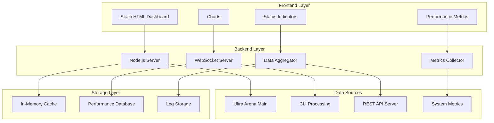

# Ultra Arena Monitor - Performance Dashboard

A performance dashboard for the Ultra Arena platform, providing insights into system performance, processing metrics, and operational status.

## 🏗️ Architecture Overview



## 📁 Directory Structure

| Directory | Purpose | Key Components |
|-----------|---------|----------------|
| **`frontend/`** | Static HTML dashboard | `static/`, `package.json` |
| **`backend/`** | Python server | `server.py`, `requirements.txt` |
| **`config/`** | Configuration files | `monitoring_config.py`, `chart_config.py` |

## 🚀 Quick Start

### Prerequisites
```bash
# Install Python dependencies
cd backend
pip install -r requirements.txt
```

### Start Monitoring Dashboard
```bash
# Start backend server
cd backend
python server.py

# Start frontend (in new terminal)
cd frontend
python -m http.server 3000
```

### Access Dashboard
```
Frontend: http://localhost:3000
Backend API: http://localhost:5000
```

## 📊 Dashboard Features

### Real-time Metrics
| Metric | Description | Update Frequency |
|--------|-------------|------------------|
| **Processing Throughput** | Files processed per minute | Real-time |
| **Response Times** | Average API response time | 5 seconds |
| **Error Rates** | Percentage of failed requests | Real-time |
| **Active Connections** | Current active users | Real-time |
| **System Resources** | CPU, Memory, Disk usage | 10 seconds |

### Performance Charts
| Chart Type | Data Source | Time Range |
|------------|-------------|------------|
| **Throughput Chart** | Processing metrics | Last 24 hours |
| **Response Time Chart** | API performance | Last 1 hour |
| **Error Rate Chart** | Error tracking | Last 24 hours |
| **Resource Usage Chart** | System metrics | Last 1 hour |

## 🔧 Configuration

### Monitoring Configuration
```python
# config/monitoring_config.py
MONITORING_CONFIG = {
    "update_interval": 5,  # seconds
    "data_retention": 24,  # hours
    "alert_thresholds": {
        "error_rate": 0.05,  # 5%
        "response_time": 10,  # seconds
        "cpu_usage": 0.8,    # 80%
        "memory_usage": 0.9  # 90%
    }
}
```

### Chart Configuration
```python
# config/chart_config.py
CHART_CONFIG = {
    "throughput_chart": {
        "title": "Processing Throughput",
        "y_axis": "Files per Minute",
        "color": "#4CAF50"
    },
    "response_time_chart": {
        "title": "Average Response Time",
        "y_axis": "Seconds",
        "color": "#2196F3"
    }
}
```

## 📈 API Endpoints

### Backend API
| Endpoint | Method | Description | Response |
|----------|--------|-------------|----------|
| `/api/metrics` | GET | Current metrics | JSON metrics |
| `/api/history` | GET | Historical data | JSON time series |
| `/api/status` | GET | System status | JSON status |
| `/api/alerts` | GET | Active alerts | JSON alerts |

### WebSocket Events
| Event | Description | Data Format |
|-------|-------------|-------------|
| `metrics_update` | Real-time metrics | JSON metrics |
| `alert_triggered` | New alert | JSON alert |
| `status_change` | Status change | JSON status |

## 🔍 Dashboard Components

### Main Dashboard
```javascript
// Dashboard layout
const Dashboard = () => {
  return (
    <div className="dashboard">
      <Header />
      <MetricsGrid />
      <ChartsSection />
      <AlertsPanel />
      <StatusPanel />
    </div>
  );
};
```

### Real-time Charts
```javascript
// Chart component
const ThroughputChart = () => {
  const [data, setData] = useState([]);
  
  useEffect(() => {
    const ws = new WebSocket('ws://localhost:5000');
    ws.onmessage = (event) => {
      const metrics = JSON.parse(event.data);
      setData(prev => [...prev, metrics]);
    };
  }, []);
  
  return <LineChart data={data} />;
};
```

## 📊 Metrics Collection

### Data Sources
| Source | Metrics | Collection Method |
|--------|---------|-------------------|
| **Ultra Arena Main** | Processing metrics | Direct API calls |
| **CLI Processing** | CLI performance | Log parsing |
| **REST API Server** | API performance | Middleware |
| **System Monitor** | System resources | OS APIs |

### Metrics Processing
```python
class MetricsCollector:
    def collect_processing_metrics(self):
        """Collect processing metrics from Ultra Arena"""
        metrics = {
            "files_processed": self.get_files_processed(),
            "processing_time": self.get_avg_processing_time(),
            "success_rate": self.get_success_rate(),
            "error_count": self.get_error_count()
        }
        return metrics
    
    def collect_system_metrics(self):
        """Collect system resource metrics"""
        metrics = {
            "cpu_usage": psutil.cpu_percent(),
            "memory_usage": psutil.virtual_memory().percent,
            "disk_usage": psutil.disk_usage('/').percent
        }
        return metrics
```

## 🚨 Alert System

### Alert Types
| Alert Type | Trigger Condition | Severity |
|------------|-------------------|----------|
| **High Error Rate** | Error rate > 5% | Critical |
| **Slow Response Time** | Avg response > 10s | Warning |
| **High CPU Usage** | CPU usage > 80% | Warning |
| **High Memory Usage** | Memory usage > 90% | Critical |
| **Service Down** | Service unavailable | Critical |

### Alert Configuration
```python
ALERT_CONFIG = {
    "high_error_rate": {
        "threshold": 0.05,
        "duration": 300,  # 5 minutes
        "severity": "critical",
        "notification": "email"
    },
    "slow_response_time": {
        "threshold": 10,
        "duration": 60,   # 1 minute
        "severity": "warning",
        "notification": "dashboard"
    }
}
```

## 📈 Performance Monitoring

### Key Performance Indicators
| KPI | Target | Current | Status |
|-----|--------|---------|--------|
| **Processing Throughput** | > 20 files/min | 25 files/min | ✅ Good |
| **Response Time** | < 5 seconds | 3.2 seconds | ✅ Good |
| **Error Rate** | < 5% | 2.1% | ✅ Good |
| **Uptime** | > 99.9% | 99.95% | ✅ Good |

### Historical Trends
```javascript
// Historical data analysis
const analyzeTrends = (data) => {
  const trends = {
    throughput: calculateTrend(data.throughput),
    responseTime: calculateTrend(data.responseTime),
    errorRate: calculateTrend(data.errorRate)
  };
  return trends;
};
```

## 🔧 Development

### Adding New Metrics
1. **Define metric** in backend collector
2. **Add API endpoint** for metric retrieval
3. **Create chart component** in frontend
4. **Update dashboard** layout

### Custom Alerts
```python
def create_custom_alert(metric, threshold, duration):
    """Create custom alert rule"""
    alert_rule = {
        "metric": metric,
        "threshold": threshold,
        "duration": duration,
        "action": "notify_admin"
    }
    return alert_rule
```

## 🐛 Troubleshooting

### Common Issues
| Issue | Cause | Solution |
|-------|-------|----------|
| **Dashboard not loading** | Backend server down | Start backend server |
| **No real-time updates** | WebSocket connection failed | Check WebSocket URL |
| **Missing metrics** | Data source unavailable | Check Ultra Arena services |
| **High latency** | Network issues | Check network connectivity |

### Debug Mode
```bash
# Enable debug logging
export DEBUG=true
python backend/server.py

# Frontend debug mode
npm start -- --debug
```

## 📝 Logging

### Log Levels
- **DEBUG**: Detailed debugging information
- **INFO**: General operational information
- **WARNING**: Non-critical issues
- **ERROR**: Error conditions
- **CRITICAL**: Critical system issues

### Log Format
```
2024-01-15 10:30:15.123 - INFO - [Monitor][collect_metrics] - Collected 15 metrics
2024-01-15 10:30:15.456 - WARNING - [Monitor][alert_check] - High error rate detected: 6.2%
```

## 🚀 Deployment

### Production Deployment
```bash
# Build frontend
npm run build

# Start production server
cd backend
gunicorn server:app -w 4 --bind 0.0.0.0:5000

# Serve frontend
serve -s build -l 3000
```

### Docker Deployment
```dockerfile
FROM node:16-alpine

WORKDIR /app
COPY package*.json ./
RUN npm install

COPY . .
RUN npm run build

EXPOSE 3000
CMD ["npm", "start"]
```

## 📊 Dashboard Screenshots

### Main Dashboard
- Real-time metrics display
- Performance charts
- System status indicators
- Alert notifications

### Performance Analysis
- Historical trend analysis
- Performance comparisons
- Resource usage tracking
- Bottleneck identification

---

For detailed API documentation, visit the dashboard at `http://localhost:3000` when running.
