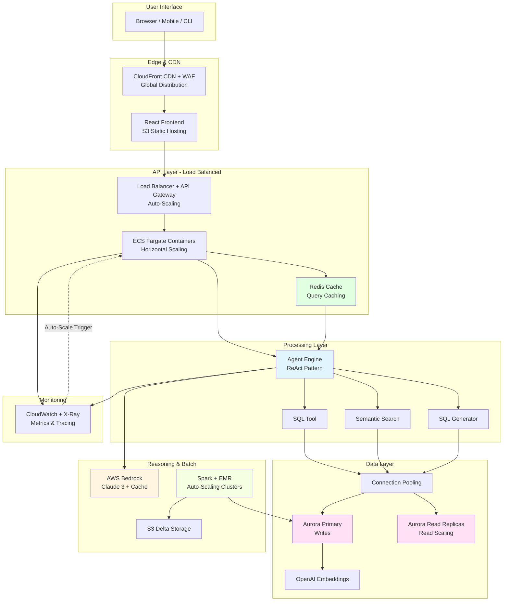
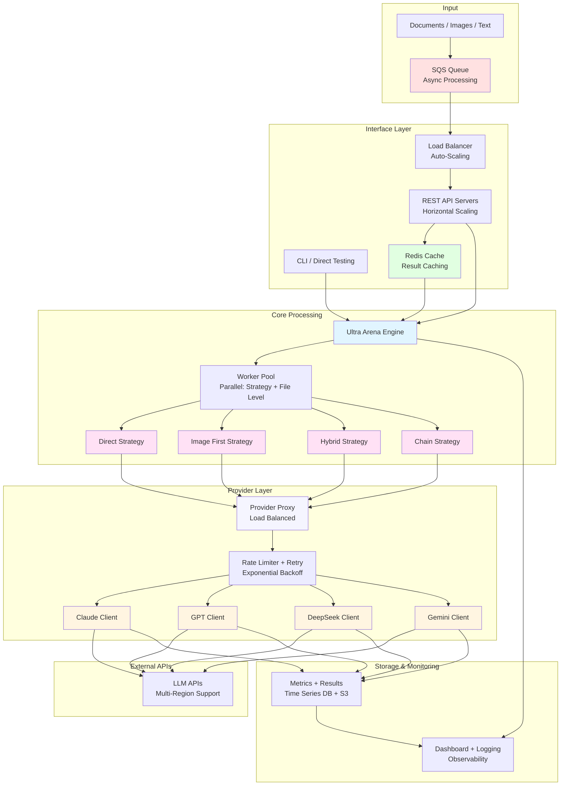
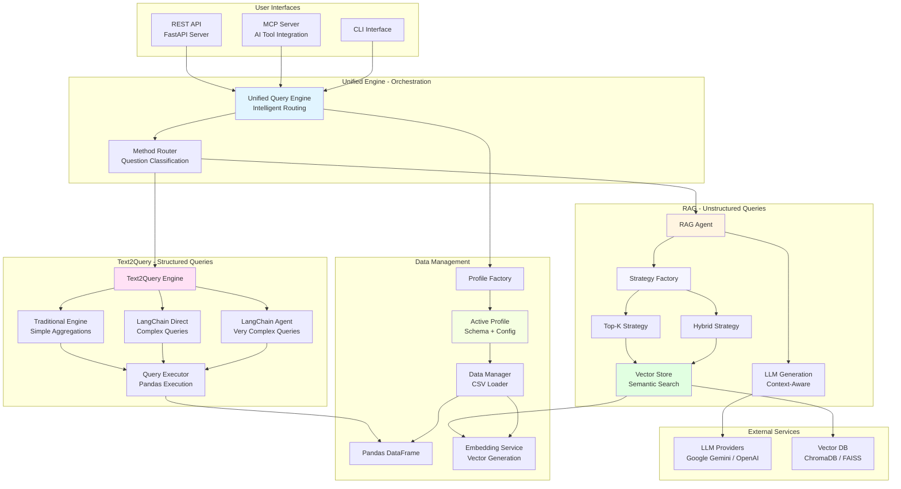

# 🎯 NuBank Software Architect Interview - Crash Preparation Guide

## 📋 Interview Overview

**Company**: NuBank (Brazil)  
**Role**: Software Architect  
**Focus Areas**:
- ✅ Understand and justify tool/technique choices
- ✅ Propose flexible, sustainable, and scalable solutions
- ✅ Collaborative design (Draw.io, Miro, Google Jamboard)
- ✅ Team collaboration approach

---

## 🏗️ PROJECT 1: FRU GenAI Analytics
**Key Architecture Pattern**: Enterprise GenAI with Separation of Concerns

### Core Architectural Decisions & Justifications

#### 1. **"The Golden Separation" - Spark vs pgvector vs Bedrock**

**Decision**: Separate batch intelligence (Spark) from interactive intelligence (pgvector) from reasoning (Bedrock)

**Justification**:
```
Spark (Offline Factory):
  ✓ Purpose: Heavy batch ETL, analytics, feature generation
  ✓ Why: Optimized for large-scale data processing
  ✓ Cost: Run on-demand, no idle costs
  ✓ Latency: Seconds to minutes (acceptable for batch)

pgvector (Online Brain):
  ✓ Purpose: Real-time semantic search, ANN retrieval
  ✓ Why: Milliseconds latency, transactional semantics
  ✓ Cost: Always-on but efficient (single Postgres instance)
  ✓ Latency: <50ms for similarity search

Bedrock (Reasoning Layer):
  ✓ Purpose: Natural language understanding and generation
  ✓ Why: AWS-native, data never leaves AWS
  ✓ Governance: IAM-controlled, VPC endpoints
  ✓ Cost: Pay-per-use, no infrastructure to manage
```

**NuBank Application**: 
- Batch fraud detection patterns (Spark)
- Real-time transaction anomaly detection (pgvector)
- Customer support chat reasoning (Bedrock)

#### 2. **Embedding Strategy: OpenAI vs Self-Hosted**

**Decision**: Use OpenAI `text-embedding-3-small` for embeddings

**Justification**:
```
Pros:
  ✓ State-of-the-art quality
  ✓ 1536 dimensions, optimized for cost
  ✓ Offline batch processing (no real-time dependency)
  ✓ Proven scalability

Cons:
  ✓ Data leaves AWS (but only customer feedback, not PII)
  ✓ API costs

Alternative Considered: Self-hosted (e.g., sentence-transformers)
  ✗ Lower quality for domain-specific tasks
  ✗ Infrastructure management overhead
  ✗ Higher latency for batch jobs
  ✓ Better data governance (all in AWS)
```

**NuBank Context**: 
- For PII-sensitive data → use AWS Bedrock Titan embeddings (all in AWS)
- For non-PII text analysis → OpenAI is acceptable

#### 3. **Agent-Based Query Processing (ReAct Pattern)**

**Decision**: Implement autonomous agent with tool-based architecture

**Justification**:
```
Why Agent-Based:
  ✓ Handles novel queries without hardcoded patterns
  ✓ Iterative refinement (can execute multiple tools)
  ✓ Extensible (easy to add new tools)
  ✓ Adapts to complex multi-step queries

Architecture:
  Agent → Plans → Executes Tools → Observes → Refines → Synthesizes

Tools:
  1. SQL Tool: Direct SQL execution
  2. Semantic Search Tool: pgvector similarity search
  3. SQL Generator Tool: LLM generates SQL from NLQ

Benefits:
  ✓ Flexible: Handles "which region has biggest sales?" (quantitative)
  ✓ Flexible: Handles "why are customers unhappy?" (qualitative)
  ✓ Flexible: Handles "improve sales at low-performing stores" (hybrid)
```

**NuBank Scenario**: 
- Query: "Why are credit card fraud rates increasing in São Paulo?"
- Agent: SQL to get fraud stats → Semantic search for fraud patterns → SQL to correlate → Synthesize insights

#### 4. **Infrastructure as Code: Terraform + Terragrunt**

**Decision**: Use Terraform modules with Terragrunt for environment management

**Justification**:
```
Terraform Modules:
  ✓ Reusable components (VPC, ECS, Aurora, ALB)
  ✓ DRY principle (Don't Repeat Yourself)
  ✓ Version-controlled infrastructure
  ✓ Team collaboration (peer review of IaC)

Terragrunt:
  ✓ Environment separation (dev/prod)
  ✓ Configuration hierarchy
  ✓ Remote state management
  ✓ Dependency management

Structure:
  modules/
    ├── vpc/
    ├── aurora/    # Postgres + pgvector
    ├── ecs/       # API containers
    ├── alb/       # Load balancer
    └── iam/       # Security roles
  
  environments/
    ├── dev/terragrunt.hcl
    └── prod/terragrunt.hcl
```

**NuBank Context**: 
- Compliance: Infrastructure changes tracked and auditable
- Multi-environment: dev/staging/prod isolation
- Team scalability: Multiple teams can own modules

#### 5. **Containerization & Orchestration: Docker + ECS Fargate**

**Decision**: Containerize API with Docker, deploy on ECS Fargate

**Justification**:
```
Docker:
  ✓ Consistent environments (dev → prod)
  ✓ Fast deployment
  ✓ Version control for application + dependencies

ECS Fargate (vs EKS or EC2):
  ✓ Serverless containers (no node management)
  ✓ Auto-scaling built-in
  ✓ Cost-effective for moderate scale
  ✓ Less operational overhead

When to use EKS instead:
  - Larger scale (1000+ containers)
  - Kubernetes expertise in team
  - Multi-cloud strategy
  - Complex service mesh requirements
```

**NuBank Scale Consideration**:
- Start with Fargate (simpler)
- Migrate to EKS if needed (containers are portable)

#### 6. **Deployment Options: ECS Fargate vs EKS vs Terraform IaC**

FRU supports multiple deployment approaches, each with different trade-offs:

##### **Option A1: ECS Fargate (Manual Setup)**

**Description**: Deploy containers on AWS ECS Fargate with manual configuration via AWS Console or CLI.

**Pros**:
- ✅ **Simplicity**: No Kubernetes complexity, easy to understand
- ✅ **Serverless containers**: No node management required
- ✅ **Quick setup**: Can deploy manually in minutes via AWS Console
- ✅ **Auto-scaling**: Built-in auto-scaling based on CPU/memory metrics
- ✅ **Cost-effective**: Pay only for running tasks (no idle node costs)
- ✅ **Lower operational overhead**: AWS manages the infrastructure
- ✅ **Native AWS integration**: Seamless IAM role integration

**Cons**:
- ❌ **Vendor lock-in**: AWS-specific, less portable to other clouds
- ❌ **Limited customization**: Less control than Kubernetes
- ❌ **Manual setup**: Requires AWS Console clicks or CLI commands
- ❌ **Configuration drift**: Manual changes can lead to inconsistencies
- ❌ **No infrastructure versioning**: Changes not tracked in git
- ❌ **Scalability limits**: Max ~1000 containers efficiently
- ❌ **Team collaboration challenges**: No peer review for infrastructure changes

**When to Use**:
- Small to medium scale (<500 containers)
- Team lacks Kubernetes expertise
- Quick prototype or MVP
- AWS-native environment
- Single developer or small team

**NuBank Context**: Good starting point for new services, but needs IaC for production compliance.

---

##### **Option B: Kubernetes / EKS Deployment**

**Description**: Deploy on Amazon EKS (managed Kubernetes) for advanced orchestration.

**Pros**:
- ✅ **Portability**: Works on any Kubernetes cluster (multi-cloud strategy)
- ✅ **Rich ecosystem**: Access to Kubernetes tools and services (Helm, Istio, etc.)
- ✅ **Fine-grained control**: Advanced scheduling, resource management, networking
- ✅ **Service mesh ready**: Easy to add Istio/Linkerd for microservices
- ✅ **Multi-cloud**: Can migrate to GKE, AKS, or on-premises
- ✅ **Community support**: Large ecosystem and community
- ✅ **Advanced features**: Horizontal pod autoscaling, custom controllers
- ✅ **Enterprise-grade**: Production patterns and best practices

**Cons**:
- ❌ **Complexity**: Steeper learning curve, requires Kubernetes expertise
- ❌ **Higher operational overhead**: Need dedicated Kubernetes knowledge
- ❌ **More expensive**: EKS control plane cost ($73/month) + node costs
- ❌ **Node management**: Need to manage/update worker nodes
- ❌ **Setup time**: More complex initial setup (hours vs minutes)
- ❌ **Overkill for simple apps**: Unnecessary complexity for basic needs
- ❌ **Debugging complexity**: More layers to troubleshoot

**When to Use**:
- Large scale (1000+ containers)
- Multi-cloud strategy
- Team has Kubernetes expertise
- Need advanced orchestration features
- Complex microservices architecture
- Service mesh requirements

**NuBank Context**: Better for mature services with complex requirements or multi-region deployments.

---

##### **Option C: Terraform IaC (Fully Automated)**

**Description**: Infrastructure as Code using Terraform + Terragrunt for automated, version-controlled deployment.

**Pros**:
- ✅ **Reproducibility**: Identical environments every time (dev/staging/prod)
- ✅ **Version control**: Infrastructure changes tracked in git with full history
- ✅ **Team collaboration**: Peer review of infrastructure changes (PR process)
- ✅ **Environment parity**: Dev matches prod architecture, reducing bugs
- ✅ **Disaster recovery**: Recreate entire infrastructure from code in minutes
- ✅ **Security by design**: Built-in best practices (IAM, Secrets Manager, VPC endpoints)
- ✅ **Automated deployment**: Infrastructure provisioned in 15-30 minutes
- ✅ **Cost optimization**: Easy to destroy/recreate environments, environment-specific sizing
- ✅ **Audit trail**: All changes logged and traceable (compliance requirement)
- ✅ **Modular architecture**: Reusable modules across projects
- ✅ **State management**: Track resource relationships and dependencies
- ✅ **Idempotent**: Safe to run multiple times without side effects

**Cons**:
- ❌ **Initial complexity**: Learning curve for Terraform/Terragrunt syntax
- ❌ **State management**: Need to manage Terraform state (S3 + DynamoDB)
- ❌ **Setup time**: Initial setup takes more time than manual (but pays off long-term)
- ❌ **Overhead**: Need Terraform knowledge in team
- ❌ **State file conflicts**: Multiple engineers need coordination (locking mechanism)
- ❌ **Abstraction layer**: One more tool to learn and maintain
- ❌ **Debugging**: Need to understand Terraform plan/apply output

**When to Use**:
- Production deployments (mandatory for compliance)
- Multiple environments (dev/staging/prod)
- Team has DevOps/Terraform expertise
- Need infrastructure versioning and auditability
- Regulatory/compliance requirements (financial services, healthcare)
- Large team with multiple engineers working on infrastructure
- Need disaster recovery capabilities

**NuBank Context**: **Highly recommended for production** - Required for compliance, auditability, team scalability, and disaster recovery.

**Comparison Summary**:

| Aspect | Option A1 (ECS Manual) | Option B (EKS) | Option C (Terraform) |
|--------|------------------------|----------------|----------------------|
| **Setup Complexity** | Low | High | Medium |
| **Operational Overhead** | Low | High | Low (after setup) |
| **Portability** | Low (AWS-only) | High (multi-cloud) | Medium (AWS-focused) |
| **Scalability** | Medium (up to 1000) | High (unlimited) | Medium-High (depends on target) |
| **Cost** | Low-Medium | Medium-High | Low (dev environments) |
| **Compliance/Audit** | Manual (risky) | Manual (risky) | ✅ Automated (auditable) |
| **Team Collaboration** | Poor | Medium | ✅ Excellent (PR reviews) |
| **Version Control** | None | None | ✅ Full git history |
| **Disaster Recovery** | Manual recreation | Manual recreation | ✅ Automated from code |
| **Production Ready** | ⚠️ Not recommended | ✅ Yes | ✅✅ Highly recommended |

**Recommended Evolution Path**:
1. **Start**: Option A1 (quick prototype/MVP)
2. **Develop**: Option C (add Terraform for dev/staging)
3. **Scale**: Option B (migrate to EKS if scale requires) OR stay with Option C + ECS
4. **Production**: **Always Option C** (compliance and auditability)

**Decision Framework for NuBank**:
```
IF compliance/audit required:
  → Use Option C (Terraform) ✅
  
ELSE IF scale > 1000 containers:
  → Consider Option B (EKS)
  
ELSE IF quick MVP/prototype:
  → Use Option A1 (but migrate to C for prod)
  
ELSE:
  → Use Option C (Terraform + ECS) - Best balance ✅
```

---

### 📐 Architecture Diagram - PROJECT 1 (FRU GenAI Analytics)

**Draw this Mermaid diagram during the interview:**



**Key Points to Highlight - Scalability Enhancements**:
1. **Horizontal Scaling**: 
   - ECS Fargate auto-scales containers based on CPU/memory (shown as Container 1, 2, N)
   - CloudWatch alarms trigger auto-scaling
   
2. **Database Scaling**:
   - Aurora read replicas for read scaling (separate write/read paths)
   - Connection pooling (PgBouncer) reduces connection overhead
   - Primary handles writes, replicas handle reads

3. **Caching Layer**:
   - ElastiCache Redis caches frequent queries
   - Reduces database load and improves latency
   - Bedrock response cache for cost optimization

4. **CDN & Edge**:
   - CloudFront for global content distribution
   - AWS WAF for security at edge
   - Reduces origin load

5. **Load Distribution**:
   - ALB distributes traffic across multiple containers
   - Target groups with health checks ensure traffic only to healthy instances

6. **Batch Layer Scaling**:
   - EMR auto-scaling Spark clusters based on workload
   - On-demand processing, no idle costs

7. **Observability**:
   - CloudWatch metrics for auto-scaling triggers
   - X-Ray for distributed tracing
   - Full visibility into system performance

**Scalability Characteristics**:
- **API Layer**: Scales horizontally (1 → N containers)
- **Database**: Scales reads via replicas, writes via instance size
- **Batch**: Scales compute clusters dynamically
- **Cost**: Pay only for what you use (auto-scaling)

---

## 🤖 PROJECT 2: Ultra Arena - Multi-LLM Platform
**Key Architecture Pattern**: Modular, Extensible LLM Evaluation System

### Core Architectural Decisions & Justifications

#### 1. **Multi-Provider Abstraction Pattern**

**Decision**: Abstract LLM providers behind a common interface

**Justification**:
```
Base Class: LLMClientBase
  ├── ClaudeClient
  ├── GPTClient
  ├── DeepSeekClient
  ├── GeminiClient
  ├── OllamaClient (local)
  └── Custom Providers

Benefits:
  ✓ Vendor lock-in avoidance
  ✓ Easy A/B testing
  ✓ Cost optimization (use cheapest model that works)
  ✓ Fallback mechanisms
  ✓ Consistent interface across providers
```

**NuBank Application**:
- Multi-model risk assessment
- Cost optimization per use case
- Fallback if primary provider has issues

#### 2. **Strategy Pattern for Processing Methods**

**Decision**: Separate processing strategies from LLM clients

**Justification**:
```
Strategies (HOW to process):
  ├── Direct File Strategy
  ├── Image First Strategy (OCR then process)
  ├── Text Only Strategy
  ├── Hybrid Strategy
  └── Chain Strategy (fallback pipeline)

LLM Clients (WHO processes):
  ├── Claude
  ├── GPT
  └── Others

Why Separate:
  ✓ Independent evolution (change strategy without changing client)
  ✓ Combinatorial testing (test all strategies × all providers)
  ✓ Reusability (same strategy works with any provider)
  ✓ Testability (mock clients easily)
```

**NuBank Scenario**:
- Document processing: OCR strategy + Claude for analysis
- Chat support: Direct text strategy + GPT (cheaper)
- Compliance docs: Chain strategy (try multiple approaches)

#### 3. **Dual-Level Parallelization**

**Decision**: Parallelize at strategy-level AND file-level

**Justification**:
```
Strategy-Level Parallelization:
  ✓ Test multiple strategies simultaneously
  ✓ Compare performance across approaches
  ✓ Faster evaluation cycles

File-Level Parallelization:
  ✓ Process multiple files concurrently within strategy
  ✓ Optimal throughput
  ✓ Better resource utilization

Configurable Concurrency:
  ✓ Adapt to hardware constraints
  ✓ Prevent rate limiting
  ✓ Cost control (parallel = higher API costs)
```

**NuBank Context**:
- High-volume transaction processing
- Parallel fraud checks
- Batch document processing

#### 4. **Modular Architecture with Multiple Interfaces**

**Decision**: Support CLI, REST API, and Direct Testing

**Justification**:
```
CLI:
  ✓ Developer productivity
  ✓ Automation scripts
  ✓ CI/CD integration

REST API:
  ✓ Integration with other services
  ✓ Web frontend support
  ✓ Mobile app support

Direct Testing:
  ✓ Unit testing
  ✓ Performance testing
  ✓ Debugging without API overhead

Core Engine (Ultra_Arena_Main):
  ✓ Shared by all interfaces
  ✓ Single source of truth
  ✓ Consistent behavior
```

**NuBank Application**:
- CLI for batch processing
- REST API for real-time services
- Direct testing for ML model evaluation

#### 5. **Performance Monitoring & Metrics**

**Decision**: Comprehensive metrics collection

**Justification**:
```
Metrics Tracked:
  ✓ Response time per provider/strategy
  ✓ Token usage (cost tracking)
  ✓ Success/failure rates
  ✓ Throughput (requests/second)
  ✓ Cost per request

Why Important:
  ✓ Data-driven decisions (which model to use)
  ✓ Cost optimization
  ✓ SLA monitoring
  ✓ Performance regression detection
```

**NuBank Requirement**:
- SLA compliance (99.9% uptime)
- Cost tracking (budget management)
- Performance monitoring (latency requirements)

### 📐 Architecture Diagram - PROJECT 2 (Ultra Arena)

**Draw this Mermaid diagram during the interview:**



**Key Points to Highlight - Scalability Enhancements**:
1. **Horizontal Scaling**:
   - Multiple REST API servers (Server 1, 2, N) behind load balancer
   - Auto-scaling based on request volume
   - Stateless design enables easy scaling

2. **Parallel Processing Architecture**:
   - **Strategy-Level Parallelization**: Test multiple strategies simultaneously (Worker 1 handles Strategy 1 & 2)
   - **File-Level Parallelization**: Process multiple files concurrently within each strategy (Worker 2 handles multiple files)
   - **Configurable Concurrency**: Adjust worker count based on hardware/rate limits

3. **Asynchronous Processing**:
   - SQS Queue for batch document processing
   - Decouples input from processing
   - Handles traffic spikes gracefully

4. **Caching Layer**:
   - Redis cache for frequently accessed results
   - Reduces redundant LLM API calls
   - Cost and latency optimization

5. **Provider Load Balancing**:
   - Provider proxy distributes requests across providers
   - Rate limiting prevents API throttling
   - Retry logic with exponential backoff for resilience

6. **Result Storage Scaling**:
   - Metrics in time-series database (scalable reads)
   - Results archived to S3 (cost-effective long-term storage)
   - Aggregated analytics for dashboard performance

7. **Observability & Reliability**:
   - Centralized logging for all components
   - Distributed tracing across strategy/provider calls
   - Alerting system for SLA monitoring

8. **Multi-Region Support**:
   - LLM APIs can use multiple regions (lower latency)
   - Provider abstraction allows failover between regions

**Scalability Characteristics**:
- **API Layer**: Horizontal scaling (1 → N servers)
- **Processing**: Parallel at strategy and file levels
- **Providers**: Load balanced, rate limited, with retries
- **Storage**: Time-series DB + S3 for different access patterns
- **Throughput**: Handles concurrent multi-strategy × multi-file processing

---

## 🤖 PROJECT 3: Unified QueryRAG Engine - Intelligent Hybrid Querying
**Key Architecture Pattern**: Intelligent Fallback with Profile-Agnostic Design

### Core Architectural Decisions & Justifications

#### 1. **Unified Query Architecture - Text2Query First, RAG Fallback**

**Decision**: Try structured querying (Text2Query) first, fallback to RAG if needed

**Justification**:
```
Text2Query (Structured Queries):
  ✓ Purpose: Direct pandas queries for structured data
  ✓ Why: Fast, precise, deterministic results
  ✓ Best For: Aggregations, filtering, quantitative analysis
  ✓ Latency: <1 second for simple queries
  ✓ Cost: Minimal (local computation)

RAG (Unstructured Queries):
  ✓ Purpose: Semantic retrieval + generation for complex questions
  ✓ Why: Handles ambiguity, qualitative questions, explanations
  ✓ Best For: Explanations, summaries, pattern discovery
  ✓ Latency: 2-5 seconds (LLM generation)
  ✓ Cost: Higher (LLM API calls)

Intelligent Fallback:
  ✓ Maximizes query success rate (>95%)
  ✓ Uses cheapest/fastest method when possible
  ✓ Automatic routing based on question type
  ✓ Unified response format regardless of method
```

**NuBank Application**:
- Transaction queries: "Sum all transactions > $1000" → Text2Query
- Customer behavior analysis: "Why do customers churn?" → RAG
- Fraud pattern explanation: "Explain this anomaly" → RAG
- Account balance queries: "Total deposits last month" → Text2Query

#### 2. **Profile-Agnostic Architecture**

**Decision**: Profile system allows switching datasets without code changes

**Justification**:
```
Profile System Design:
  ✓ Each profile = independent data schema + config
  ✓ Zero-code dataset switching
  ✓ Consistent interface across all profiles
  ✓ Profile-specific cleaning rules
  ✓ Profile-specific LLM configurations

Benefits:
  ✓ Multi-tenant architecture (different customers = different profiles)
  ✓ Rapid onboarding (new dataset = new profile)
  ✓ A/B testing (compare profiles)
  ✓ Data isolation (profiles don't interfere)
```

**NuBank Scenario**:
- Profile: "transactions" → Customer transaction data
- Profile: "fraud_patterns" → Fraud detection dataset
- Profile: "customer_support" → Support ticket corpus
- Switch between profiles via configuration (no code changes)

#### 3. **Three-Tier Text2Query Method Selection**

**Decision**: Three methods for Text2Query (Traditional → LangChain Direct → LangChain Agent)

**Justification**:
```
Traditional Engine:
  ✓ Use Case: Simple aggregations (sum, average, count)
  ✓ Performance: Fastest (<100ms)
  ✓ Examples: "What is the average transaction amount?"

LangChain Direct:
  ✓ Use Case: Complex queries (filters, joins, conditions)
  ✓ Performance: Balanced (1-2 seconds)
  ✓ Examples: "Show transactions > $1000 in Q1 2024"

LangChain Agent:
  ✓ Use Case: Very complex multi-step queries
  ✓ Performance: Slower but most capable (2-5 seconds)
  ✓ Examples: "Compare fraud rates across regions and time periods"

Intelligent Selection:
  ✓ Heuristic-based method selection
  ✓ Performance tracking per method
  ✓ Adaptive learning from history
  ✓ Cost optimization (use simplest method that works)
```

**NuBank Context**:
- Simple queries: Account balance → Traditional
- Complex queries: Regional comparison → LangChain Direct
- Very complex: Multi-dimensional analysis → LangChain Agent

#### 4. **Strategy Pattern for RAG Retrieval**

**Decision**: Pluggable retrieval strategies (Top-K vs Hybrid)

**Justification**:
```
Top-K Strategy:
  ✓ Purpose: Quantity-focused (get N most similar documents)
  ✓ Best For: Large document collections, exploratory queries
  ✓ Performance: Fast, predictable
  ✓ Trade-off: May include less relevant results

Hybrid Strategy:
  ✓ Purpose: Quality-focused with similarity threshold
  ✓ Best For: Precise answers, smaller curated datasets
  ✓ Performance: Slower but higher precision
  ✓ Trade-off: May return fewer results

Strategy Factory:
  ✓ Runtime strategy selection
  ✓ Profile-specific strategy configuration
  ✓ Easy to add new strategies
  ✓ Test different approaches per use case
```

**NuBank Application**:
- Regulatory docs (precise answers) → Hybrid strategy
- Customer support history (broad search) → Top-K strategy
- Fraud patterns (quality matters) → Hybrid strategy

#### 5. **Multi-Interface Support: REST API + MCP Server**

**Decision**: Support both REST API and MCP (Model Context Protocol) server

**Justification**:
```
REST API:
  ✓ Standard HTTP integration
  ✓ Easy to integrate with web/mobile apps
  ✓ Stateless, scalable
  ✓ Standard authentication/authorization

MCP Server:
  ✓ Protocol for AI tool integration
  ✓ Enables AI assistants to query data directly
  ✓ Structured tool definitions
  ✓ Better for AI-to-AI communication

Dual Interface:
  ✓ Same core engine, different access patterns
  ✓ Reach broader integration scenarios
  ✓ Future-proof (MCP is emerging standard)
  ✓ Backward compatible (REST still works)
```

**NuBank Context**:
- Web dashboard → REST API
- Mobile app → REST API
- AI assistant integration → MCP Server
- Internal tools → Either/both

### 📐 Architecture Diagram - PROJECT 3 (Unified QueryRAG Engine)

**Draw this Mermaid diagram during the interview:**



**Key Points to Highlight - Scalability Enhancements**:
1. **Intelligent Routing**:
   - Question classification determines optimal method
   - Automatic fallback ensures high success rates
   - Performance-based method selection (learns from history)

2. **Profile-Based Scalability**:
   - Multi-tenant architecture (one engine, many profiles)
   - Isolated data processing per profile
   - Zero-code dataset switching

3. **Horizontal Method Scaling**:
   - Three-tier Text2Query methods (simple → complex)
   - Multiple RAG strategies (Top-K vs Hybrid)
   - Pluggable architecture (easy to add new methods/strategies)

4. **Caching Opportunities**:
   - Query result caching (common queries)
   - Embedding caching (same documents)
   - LLM response caching (similar questions)

5. **Resource Optimization**:
   - Use cheapest method that works (Traditional < LangChain Direct < Agent)
   - Profile-specific resource allocation
   - Adaptive performance tuning

6. **Multi-Interface Support**:
   - REST API for standard integrations
   - MCP Server for AI tool integration
   - CLI for automation/scripts
   - All share same core engine (DRY principle)

**Scalability Characteristics**:
- **Query Success**: >95% through intelligent fallback
- **Method Selection**: Automatic based on query complexity
- **Multi-Tenancy**: Profile-based isolation and scaling
- **Performance**: 1-3 seconds average (depends on method)
- **Extensibility**: Easy to add new methods, strategies, profiles

---

## 🎨 Collaborative Design Approach

### Tools Recommendation

**Primary**: **Miro** or **Draw.io (diagrams.net)**
- **Why**: Best for architecture diagrams
- **Features**: Real-time collaboration, templates, exports

**For Brainstorming**: **Google Jamboard**
- **Why**: Free-form ideation
- **Use Case**: Initial problem exploration

### Design Process Framework

#### Phase 1: Problem Understanding (15 min)
```
✓ Understand requirements
✓ Identify constraints (scale, latency, cost)
✓ Clarify assumptions
✓ Ask clarifying questions
```

**Questions to Ask**:
- What's the expected volume?
- What are latency requirements?
- What's the budget?
- What are compliance requirements?
- What's the team expertise?

#### Phase 2: Architecture Sketch (20 min)
```
✓ High-level components
✓ Data flow
✓ Integration points
✓ Key technologies
```

**Elements to Include**:
- User/Client Layer
- API Gateway / Load Balancer
- Application Services
- Data Layer
- External Services
- Monitoring/Observability

#### Phase 3: Decision Justification (15 min)
```
✓ Why each technology?
✓ Trade-offs considered
✓ Alternatives evaluated
✓ Cost/performance implications
```

**Justification Framework**:
1. **Requirement**: What problem does it solve?
2. **Options**: What alternatives exist?
3. **Decision**: What did we choose?
4. **Rationale**: Why this over others?
5. **Trade-offs**: What did we give up?

#### Phase 4: Scalability & Sustainability (10 min)
```
✓ How does it scale?
✓ What are bottlenecks?
✓ How to evolve?
✓ What's the migration path?
```

---

## 🗣️ Key Talking Points - Decision Justifications

### 1. "Why Spark + Delta for Batch?"

**Answer**:
- **Scale**: Handles petabytes of data
- **Cost**: On-demand clusters, no idle costs
- **Delta Lake**: ACID transactions, time travel, schema evolution
- **NuBank Scale**: Millions of transactions, perfect fit

### 2. "Why pgvector instead of Elasticsearch?"

**Answer**:
- **Integration**: Native Postgres extension, no separate service
- **Transactional**: ACID guarantees with vector search
- **Cost**: Single database for structured + vector data
- **Latency**: <50ms for ANN search
- **Trade-off**: Less advanced than Elasticsearch, but simpler ops

### 3. "Why Agent-Based Architecture?"

**Answer**:
- **Flexibility**: Handles novel queries without hardcoding
- **Extensibility**: Easy to add new tools
- **Iterative**: Can refine based on intermediate results
- **Maintainability**: Single agent vs multiple if/else branches

### 4. "Why ECS Fargate over EKS?"

**Answer**:
- **Simplicity**: Less operational overhead
- **Cost**: No node management costs
- **Scale**: Sufficient for 100s of containers
- **Migration Path**: Containers portable to EKS if needed later

### 5. "Why Terraform + Terragrunt?"

**Answer**:
- **Infrastructure as Code**: Version-controlled, auditable
- **Reusability**: Modules reduce duplication
- **Multi-Environment**: Dev/staging/prod consistency
- **Team Collaboration**: Peer review of infrastructure changes

---

## 📊 Scalability Considerations

### Horizontal Scaling

**API Layer (ECS Fargate)**:
- Auto-scaling based on CPU/memory
- Load balancer distributes traffic
- Stateless services (easy to scale)

**Database (Aurora Postgres)**:
- Read replicas for read scaling
- Connection pooling (PgBouncer)
- Query optimization (indexes)

### Vertical Scaling

**When to Scale Up**:
- Single-threaded bottlenecks
- In-memory processing requirements
- Database query optimization

**When to Scale Out**:
- Stateless services (API)
- Parallelizable workloads
- Cost optimization

### Cost Optimization

**Strategies**:
1. **Reserved Capacity**: For predictable workloads
2. **Spot Instances**: For batch jobs (Spark)
3. **Right-Sizing**: Match instance size to workload
4. **Auto-Scaling**: Scale down during low traffic
5. **Caching**: Reduce database load

---

## 🔄 Sustainability & Evolution

### Code Organization

**Modular Design**:
- Independent modules (easy to replace)
- Clear interfaces (minimal coupling)
- Testability (unit tests per module)

**Documentation**:
- Architecture decisions (ADR - Architecture Decision Records)
- API documentation
- Runbooks for operations

### Technology Choices

**Avoid Lock-In**:
- Abstract providers (LLM clients)
- Standard protocols (REST, SQL)
- Containerization (Docker)

**Migration Paths**:
- Start simple (ECS) → evolve (EKS) if needed
- pgvector → Elasticsearch if scale requires
- Bedrock → Self-hosted if governance requires

---

## 🎯 NuBank Interview Specifics

### Brazilian Context

**Considerations**:
- **Regulatory**: BACEN (Central Bank) compliance
- **Scale**: 100M+ customers
- **Payment Systems**: PIX, credit cards
- **Localization**: Portuguese language support

### Fintech Challenges

**Security**:
- PCI-DSS compliance (payment data)
- Encryption at rest and in transit
- Audit trails
- Data residency (some data must stay in Brazil)

**Reliability**:
- 99.9% uptime SLA
- Multi-region deployment
- Disaster recovery
- Zero-downtime deployments

**Performance**:
- Sub-second transaction processing
- Real-time fraud detection
- Low-latency customer experience

---

## 💡 Key Phrases & Frameworks

### Decision Justification Framework

```
"I chose [TECHNOLOGY] because:
1. It solves [SPECIFIC PROBLEM]
2. I considered [ALTERNATIVE 1] and [ALTERNATIVE 2]
3. [TECHNOLOGY] is better because [REASON]
4. Trade-off: [WHAT WE GAVE UP]
5. Migration path: [HOW TO CHANGE LATER IF NEEDED]"
```

### Scalability Answer

```
"To scale this architecture:
1. Horizontal: [HOW TO ADD MORE INSTANCES]
2. Vertical: [HOW TO INCREASE INSTANCE SIZE]
3. Database: [READ REPLICAS, SHARDING, ETC]
4. Caching: [WHERE TO ADD CACHING]
5. Cost: [HOW TO OPTIMIZE COSTS]"
```

### Team Collaboration

```
"When designing with a team:
1. Start with problem understanding (everyone aligned)
2. Sketch high-level together (visual collaboration)
3. Divide components (ownership)
4. Review together (feedback loop)
5. Document decisions (ADRs)"
```

---

## 🚀 Quick Reference: Architecture Diagrams

### FRU GenAI Architecture (Simplified)

```
User Query
    ↓
API (ECS Fargate)
    ↓
Agent (ReAct Pattern)
    ├── Tool 1: SQL Query
    ├── Tool 2: Semantic Search (pgvector)
    └── Tool 3: SQL Generation
    ↓
Results Synthesis (Bedrock)
    ↓
Response

Batch Layer (Parallel):
Spark + Delta → Analytics → Postgres
```

### Ultra Arena Architecture (Simplified)

```
Input Documents
    ↓
Strategy Layer
    ├── Direct File
    ├── Image First
    └── Text Only
    ↓
LLM Provider Layer
    ├── Claude
    ├── GPT
    └── Others
    ↓
Results + Metrics
    ↓
Monitoring Dashboard
```

---

## ✅ Pre-Interview Checklist

### Technical Preparation
- [ ] Understand both projects deeply
- [ ] Prepare decision justifications
- [ ] Know scalability patterns
- [ ] Understand NuBank context (fintech, Brazil)

### Collaborative Tools
- [ ] Familiar with Miro/Draw.io
- [ ] Practice drawing architecture diagrams
- [ ] Prepare to explain while drawing

### Communication
- [ ] Practice explaining technical concepts simply
- [ ] Prepare to ask clarifying questions
- [ ] Ready to discuss trade-offs openly

### NuBank Specific
- [ ] Research NuBank tech stack (if public)
- [ ] Understand Brazilian fintech regulations
- [ ] Think about scale (100M+ customers)

---

## 🎓 Example Interview Flow

### Scenario: "Design a fraud detection system"

**Your Approach**:

1. **Understand** (Ask questions):
   - Volume? (transactions/day)
   - Latency requirement? (real-time vs batch)
   - Types of fraud? (credit card, account takeover, etc.)
   - Data available? (transaction history, user behavior)

2. **Sketch Architecture** (Draw.io/Miro):
   ```
   Transaction → API Gateway → Stream (Kinesis)
                                      ↓
                              Processing (Lambda/ECS)
                                      ↓
                         ┌────────────┴────────────┐
                    Real-time DB          Batch (Spark)
                    (pgvector)            (Delta Lake)
                         ↓                      ↓
                    Pattern Match        Historical Analysis
                         ↓                      ↓
                    Bedrock Reasoning ← Results
                         ↓
                    Alert/Action
   ```

3. **Justify Decisions**:
   - **Kinesis**: High throughput, auto-scaling
   - **Lambda/ECS**: Parallel processing, cost-effective
   - **pgvector**: Real-time similarity search
   - **Spark**: Batch pattern discovery
   - **Bedrock**: Reasoning on complex cases

4. **Discuss Scalability**:
   - Horizontal scaling for processing
   - Database read replicas
   - Caching layer
   - Cost optimization strategies

5. **Discuss Evolution**:
   - Start with simple rules
   - Add ML models incrementally
   - A/B testing framework
   - Monitoring and alerting

---

## 📝 Final Tips

1. **Start Simple**: Begin with basic architecture, then add complexity
2. **Ask Questions**: Don't assume requirements
3. **Discuss Trade-offs**: Show you understand there's no perfect solution
4. **Think Out Loud**: Share your reasoning process
5. **Collaborate**: Invite feedback, show team player attitude
6. **Focus on NuBank Context**: Scale, compliance, Brazilian market

---

**Good luck! 🚀**

